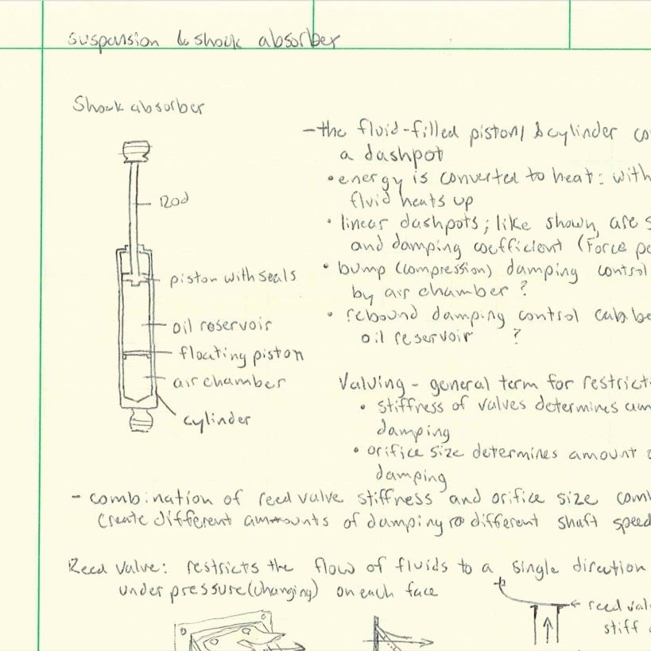

## About
This section is for engineering topics outside of school.  Career is the best word I can use for right now.  Perhaps it will include internships, projects, and extracurricular team efforts that center on engineering.  If I were to give guidance to an aspiring engineer, such guidance would be incomplete without these discussions.  So, expect to find contents about jobs and also things that are not jobs but essential pieces of an engineering career.

## Automotive
Automotive study, for a mechanical engineer or others who love car design.  Download my binder from 2009.

* [Automotive Study Binder PDF](https://raw.githubusercontent.com/dmalawey/openME/main/docs/2009_Automotive_Binder.pdf)

## Best Practices
A section for best practices collected from world-class engineering teams.  Timeless is the key.  These items may look old and its because they have worked for decades and have not expired.

### Problem Solving
Toyota Business Practice is focused on engineering, and engineering is focused on problem-solving.  Toyota has refined methodologies for breaking down problems and solving them.  This guide is followed by the engineers at Toyota worldwide.
* [Toyota Problem Solving Guide PDF](https://raw.githubusercontent.com/dmalawey/openME/main/docs/2014_toyotaProblemSolving.pdf)
