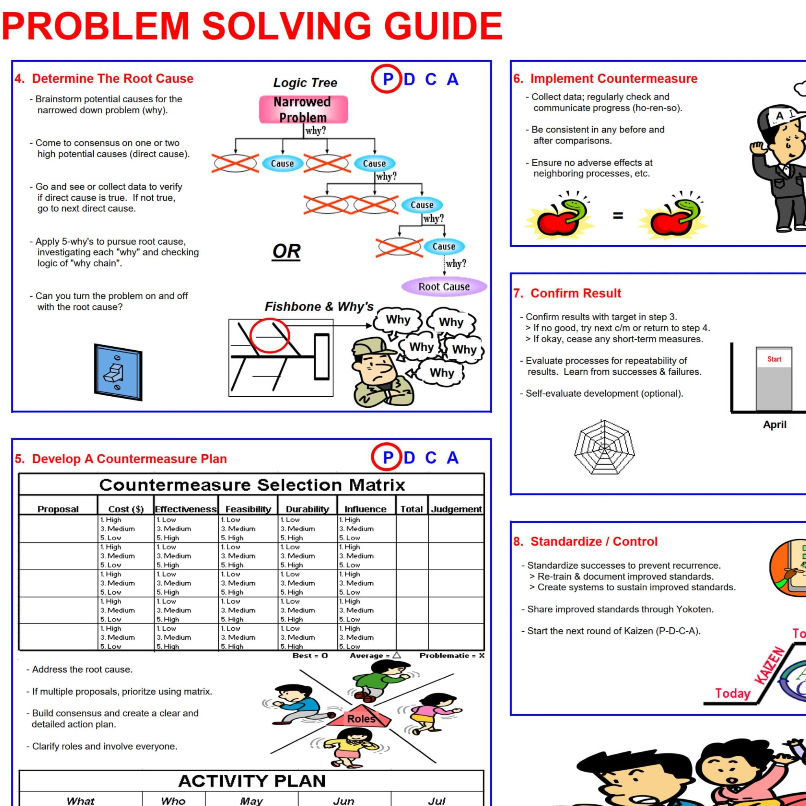
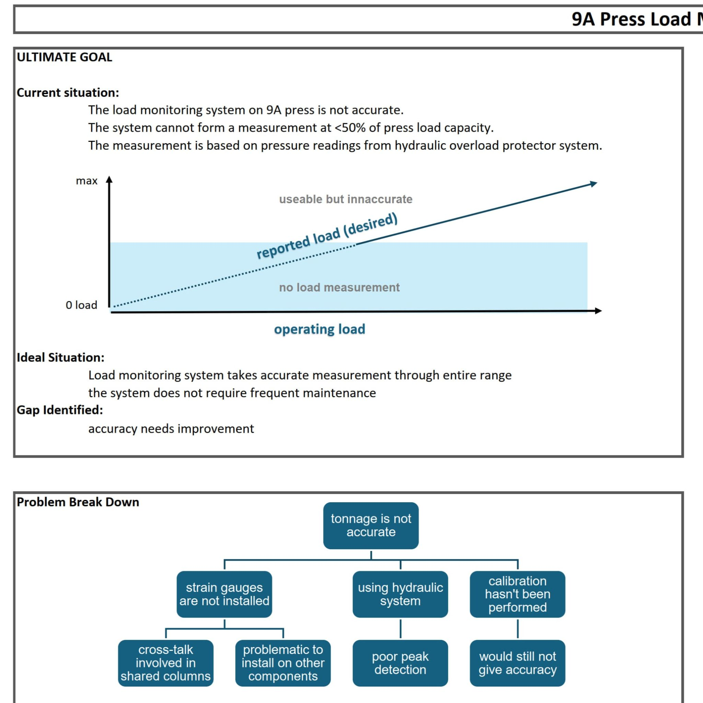
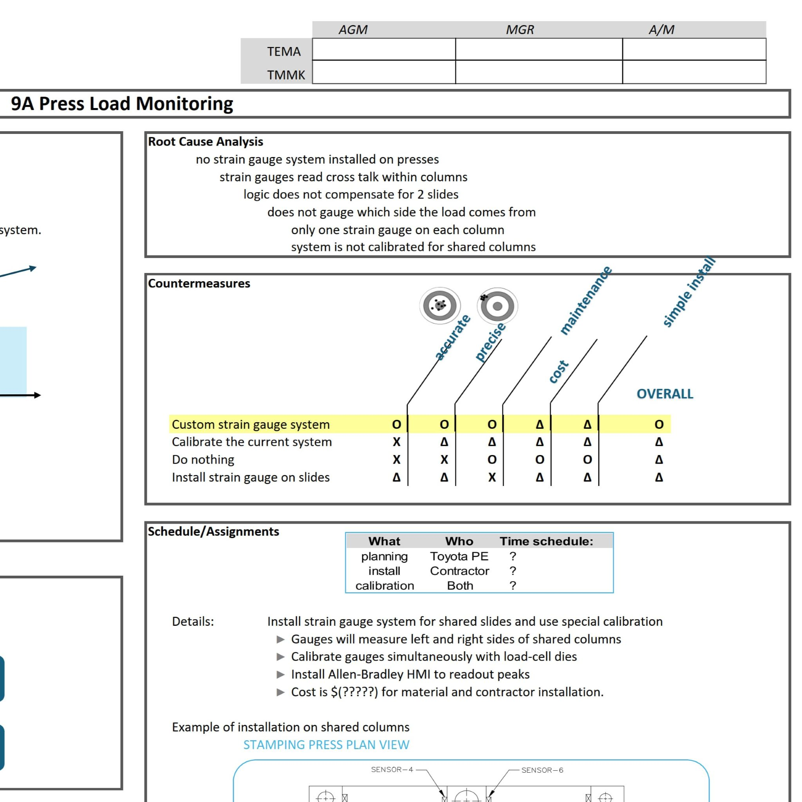
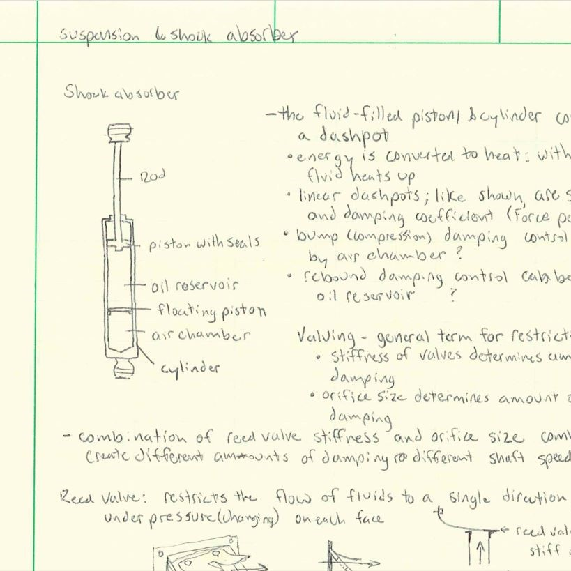
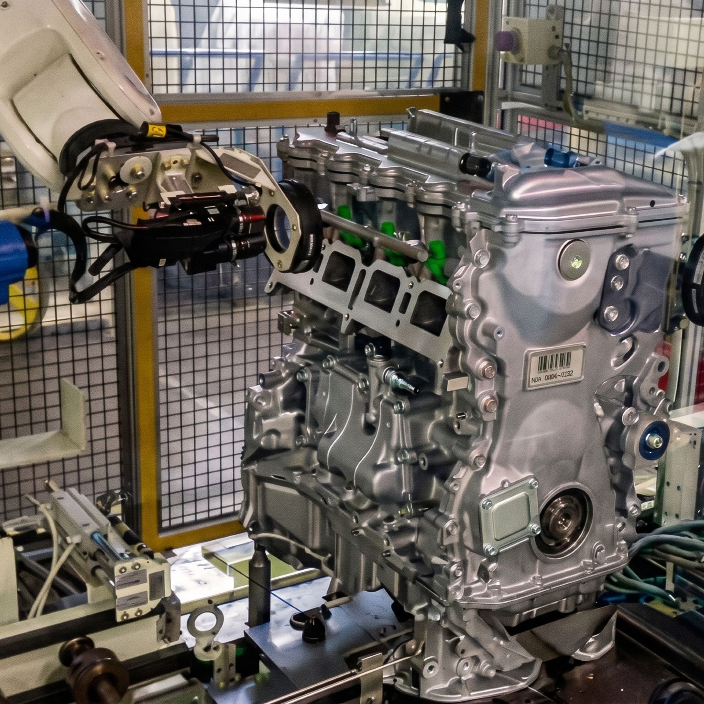
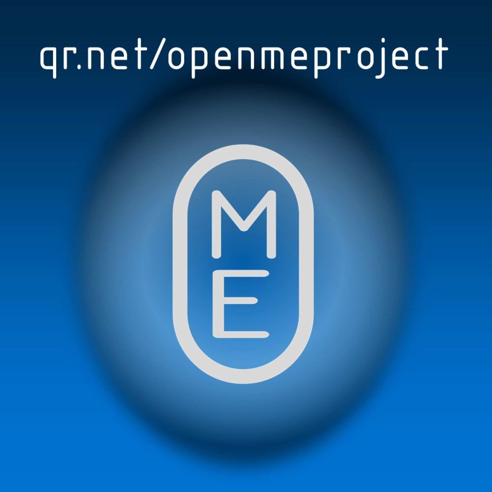

## About
This section is for engineering topics outside of school.  Career is the best word I can use for right now.  Perhaps it will include internships, projects, and extracurricular team efforts that center on engineering.  If I were to give guidance to an aspiring engineer, such guidance would be incomplete without these discussions.  So, expect to find contents about jobs and also things that are not jobs but essential pieces of an engineering career.

## Intern-Level
Find here some compiled outputs from my internship experience.  From many elements, the most valuable takeaway from my first internship was the introduction to problem-solving with a defined methodology.  My first internship placed me in the stamping department of Toyota's georgetown plant, TMMK or Toyota Motor Manufacturing Kentucky.  My stamping team would be categorized as a team of **Manufacutring Engineering** and the job of the engineers was to get huge machines installed, running, calibrated, then to have the machines serviced, maintained, adjusted, and made to be safe - all in an ongoing timeline for a whole array of machines that turn sheet metal into car parts.  In a typical vehicle, the automaker does not make steel but performs all of the value add between the steel and the vehicle at the dealership.  The biggest value add is in the stamping plant where the world's largest stamping press machines make a series of operations: forming, cutting, trimming, further forming. 

Since 2009 was a post-catastrophic automotive period, production was slow and changes were high.  Slow times are when the engineers try to implement the upgrades that can't be executed while all the machines are building cars.  That's the same time when engineers ask the interns to step aside so they can get work done uninterrupted.  Bummer.  I received a problem exercise from my manager Doug, to solve a long-term problem with our largest presses.  The load-measuring system was not accurate.  Imagine 50,000 pounds of force between two massive metal dies that need to clench like a jaw within a fractin of a milimeter, so the steel forms like it should.  It's like operating a kitchen knife to peel back a cell membrane - big challenge.  So, we rely on strain measurements that check the stress on the huge vertical columns that connect the upper and lower frames of the stamping press, and then compute meaning from it beyond the noise, cross-talk, and offsets from all the masses and vibrations.

They essentially gave me a problem that is not likely to see a solution that year but has sufficient complexity to fulfill a study and an **A3 Problem Solving report** Across the whole world, Toyota's engineers use this method and this template to solve problems, gather inputs, and report solutions and plans to managers.  

* Download the [A3 Problem Solving Guide PDF](https://github.com/dmalawey/openME/blob/eb561d1ff8efc1e03184a2f776718231e73f2461/docs/toyota_A3guide.pdf) with graphics and template. 
* Download the [A3 Template XLS](https://github.com/dmalawey/openME/blob/eb561d1ff8efc1e03184a2f776718231e73f2461/docs/toyota_A3guide.xlsx) with core template in Excel.
* Download [my internship A3 PDF](https://github.com/dmalawey/openME/blob/eb561d1ff8efc1e03184a2f776718231e73f2461/docs/toyota_A3malawey.pdf) with my problem-solving report.
* Download [my A3 Problem-solving spreadsheet in XLS format](https://github.com/dmalawey/openME/blob/eb561d1ff8efc1e03184a2f776718231e73f2461/docs/toyota_A3malawey.xlsx), an improved excel template.

_Below, see a snippet from Toyota's problem solving guide, and two snippets from my problem solving report._
- 
- 
- 

## Automotive
Automotive study, for a mechanical engineer or others who love car design.  Download my binder from 2009.

* [Automotive Study Binder PDF](https://raw.githubusercontent.com/dmalawey/openME/main/docs/2009_Automotive_Binder.pdf)

_Below, a snip from my automotive study binder posted above.  Next, a camry engine on the assembly line at TMMK (from 2013 as a full-timer). Lastly, a photo of part of the stamping area inside of the plant from an online video.  It's difficult to get photos and footage in this plant as photography is not allowed._
- 
- 
- 

## Best Practices
A section for best practices collected from world-class engineering teams.  Timeless is the key.  These items may look old and its because they have worked for decades and have not expired.

### Problem Solving
Toyota Business Practice is focused on engineering, and engineering is focused on problem-solving.  Toyota has refined methodologies for breaking down problems and solving them.  This guide is followed by the engineers at Toyota worldwide.
* [Toyota Problem Solving Guide PDF](https://raw.githubusercontent.com/dmalawey/openME/main/docs/2014_toyotaProblemSolving.pdf)
