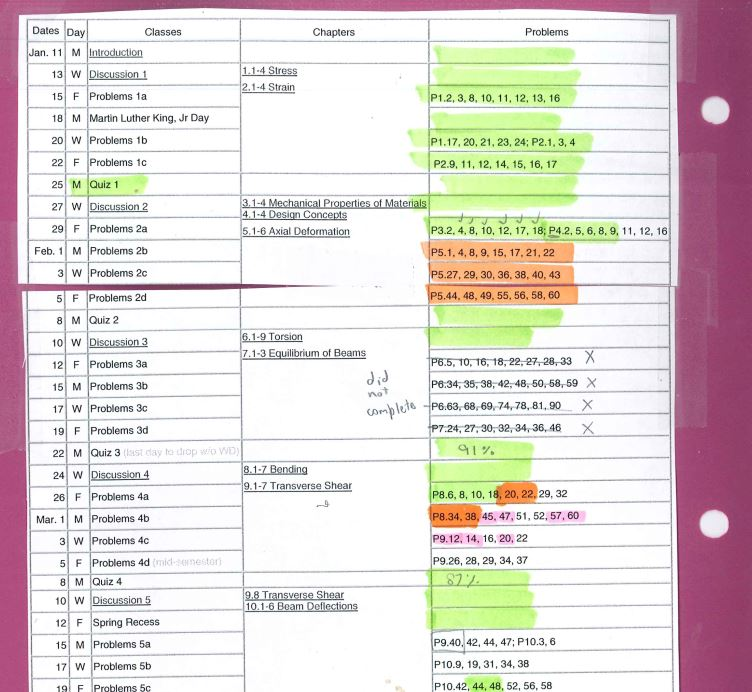
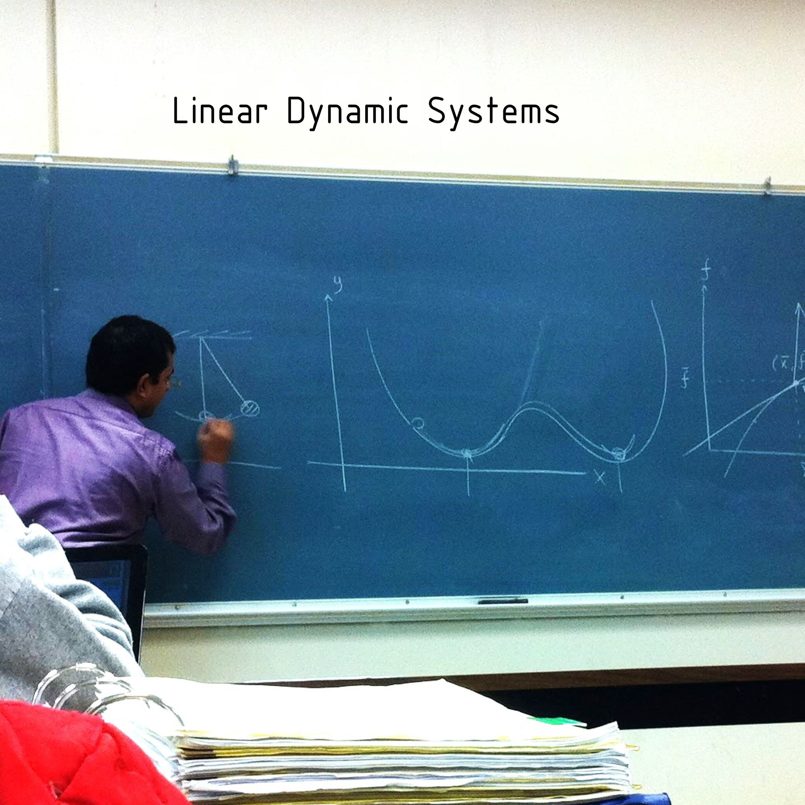
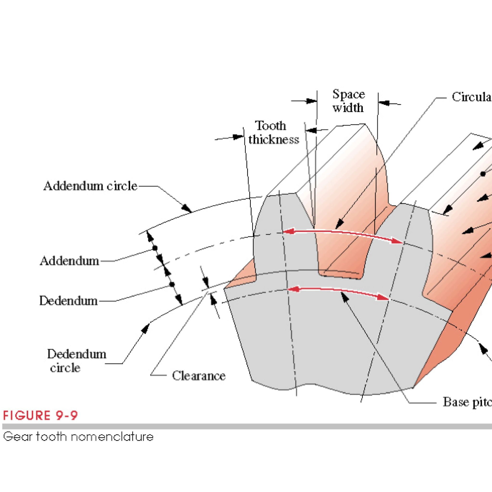
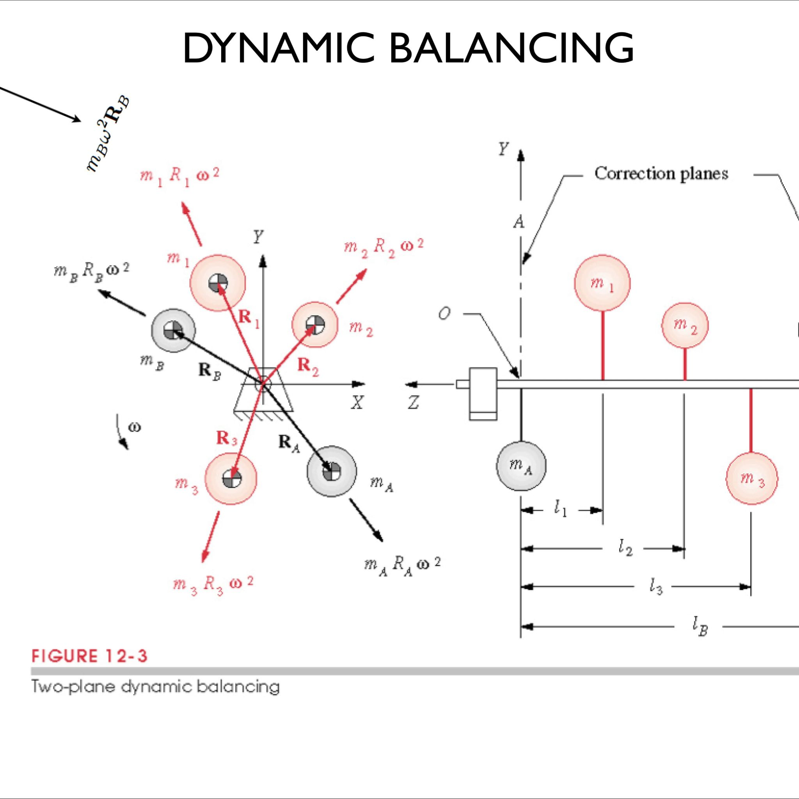
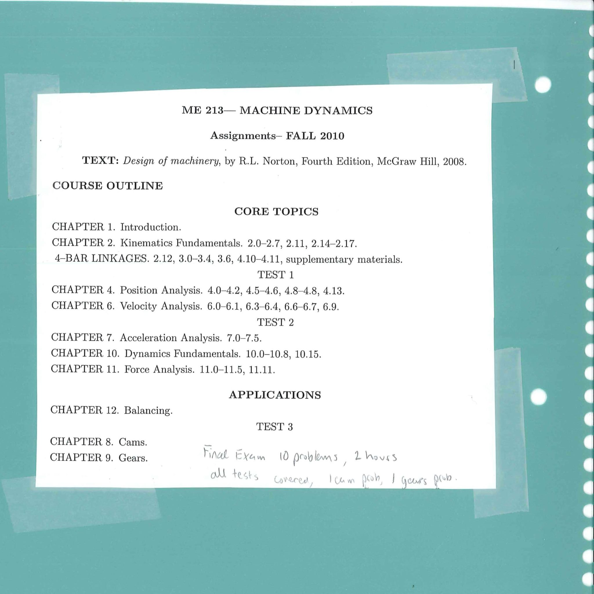
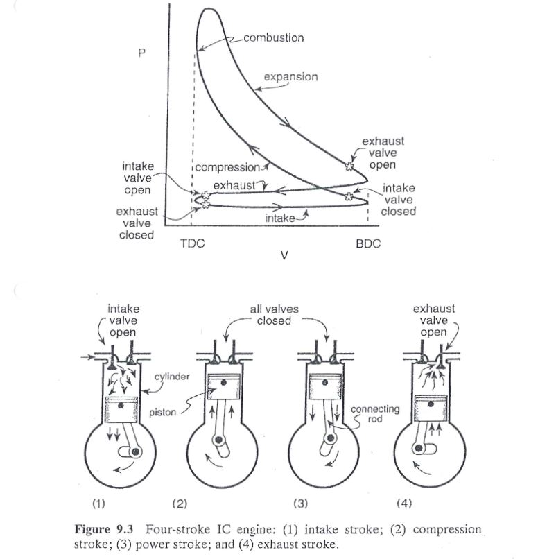
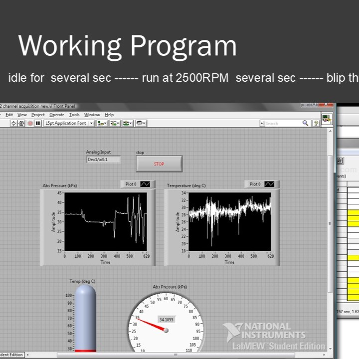
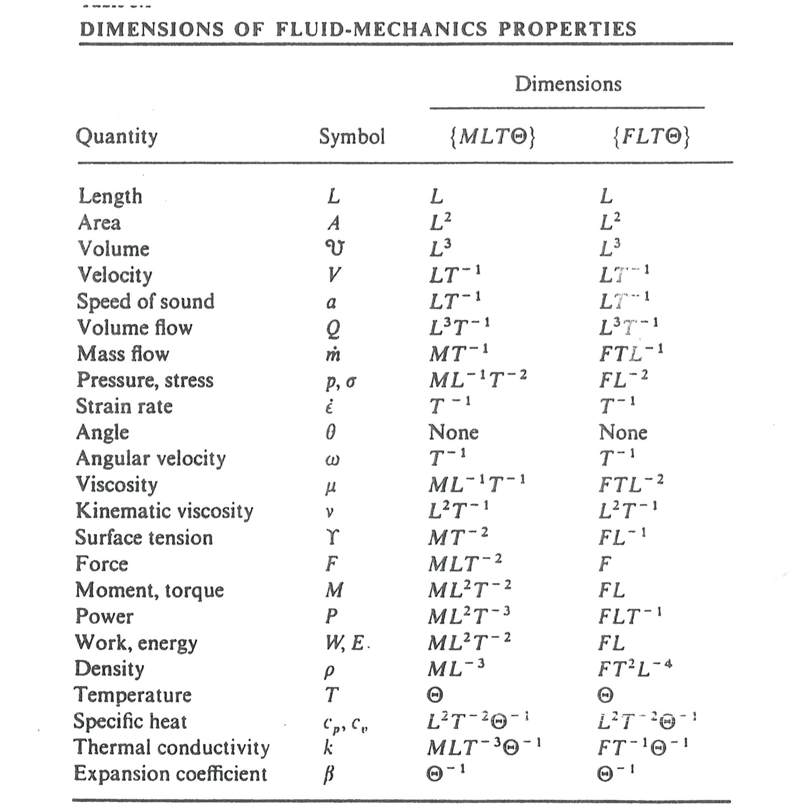
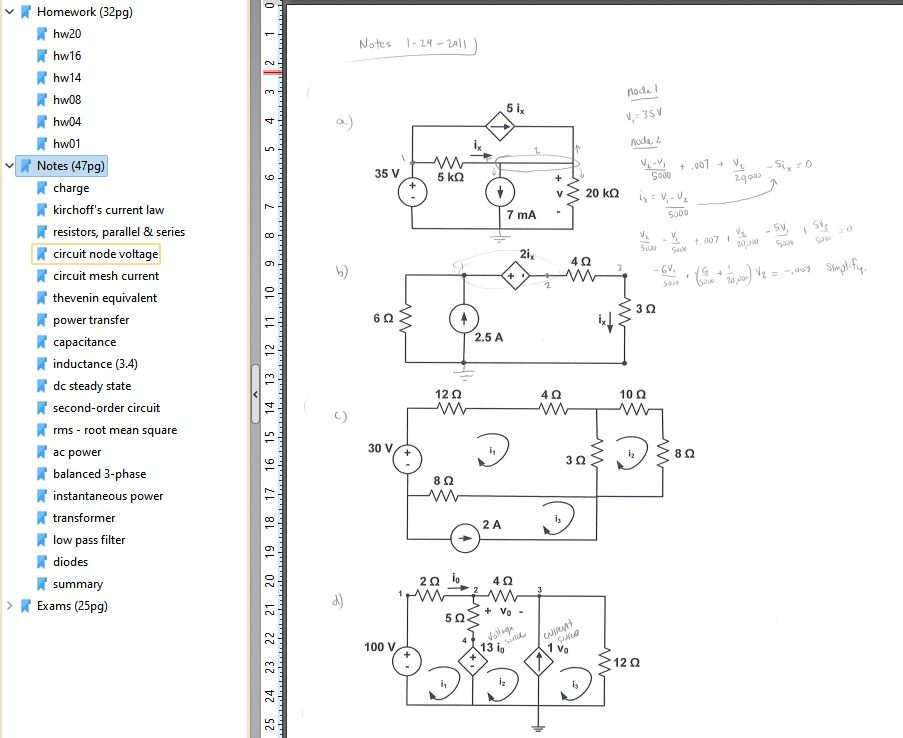

**Courses:** Mechanical Engineering Courses, organized by course curriculums.

_note: engineering knowledge is not fundamentally divided into these topics such as statics and dynamics. But in education and science, we assign these categories of engineering topics that are fairly recognized around the world.  Each individual course may also correspond to a specialty that characterizes an entire lifelong career of an expert in the field._

## Outline

_snapshot of the degree plan for mechanical engineer_

Download the PDF course outline. (as of Feb 2025, just 1 page) This is a placeholder for a more thorough document that explains a bit about syllabi of each course, together with the degree plan.
* [Mechanical Degree Plan PDF](https://raw.githubusercontent.com/dmalawey/openME/main/docs/2008_ME_degreePlan.pdf)

## IDE110-Mechanics of Materials
Mechanics of Materials applies physics to physical materials.  Deformation, bending, loads, strain, yield strength, elastic modulus, are concepts put to work in Mechanics of Materials.  IDE stands for interdisciplinary engineering, and this course is assigned to IDE because several curriculums stand on mechanics, such as Structural Engineering, Mechanical Engineering, Aerospace Engineering, Civil Engineering, and so-on.  IDE110 was the course title (with 3 credit hours) and IDE120 was the lab title (an additional 1 or 2 credit hours, with one long meeting per week and a report following).

- 
- 

Download the labs for mechanics of materials here:
* [IDE110 Notebook](https://raw.githubusercontent.com/dmalawey/openME/main/docs/IDE110_Mechanics_Notes.pdf)
* [IDE120 Lab Reports](https://raw.githubusercontent.com/dmalawey/openME/main/docs/IDE120_labs.pdf)

## MATH210-Calculus
The binder covers Calculus I, II, and III.  In reality, my math courses were complete chaos.  Back in high school, I missed out on calculus and took some hands-on electives instead, like pottery. Ultimately I enrolled at 3 different college campuses to catch up.   I wish my advisor would have urged me to enroll in calculus at the time I informed her I wished to become an engineer.  So in the summer after freshman year of college, I took calc-1 at saint louis community college back home, while working my lawncare business for cash.  Then during sophomore year, I took accelerated calc 2 and calc3 at the community college, which were compressed into 10 weeks each instead of an ordinary 5-month semester.  I became progressively more confused in each course, with a miserably dull & heartless professor about age 99.  It was solid 3-hour lectures starting at 7pm, and I wore out pencils scribbling away to keep pace with the whiteboard in hopes to study after class.  Everything moved way too fast as I tried to catch up my math to the pace of the ME degree.  (calc II is a prerequisite for almost all core courses).  By graduation, I couldn't even tell you which topics belong in which calculus course.  It was all a total blurr.

Download Calculus I, II, III binder
* [MATH210 Binder](https://raw.githubusercontent.com/dmalawey/openME/main/docs/MATH210_calculus_binder.pdf)

## ME50-Statics
Statics applies physics of forces, mass, friction, and geometry to physical designs to evaluate static forces (non-moving).  It is the key principal for structures and also for dynamic items during their static states, like a parked car. This course was actually called IDE50, in interdisciplinary department because it serves all engineering majors. 

Download Statics Content
* [IDE50 Binder](https://raw.githubusercontent.com/dmalawey/openME/main/docs/IDE50_StaticsBinder.pdf)
* [IDE50 NOTES](https://raw.githubusercontent.com/dmalawey/openME/main/docs/IDE50_StaticsNotes.pdf)

## ME160-Dynamics
Dynamics is physics applied to moving bodies.  Compute linear and rotating masses, forces, accelerations, and stored energy for machines.

Download the binders for dynamics here:
* [ME160 BINDER](https://raw.githubusercontent.com/dmalawey/openME/main/docs/ME160_Dynamics_Binder.pdf)
* [ME160 NOTES](https://raw.githubusercontent.com/dmalawey/openME/main/docs/ME160_Dynamics_Notes.pdf)

Thumbnails for Dynamics content
- 
- 

## ME208-Machine_Design
Machine Design is an application of prerequisite topics like statics, free body motion, and heavy geometry, towards assemblies that put the physics to work.

Download the binders for machine design here:
* [ME160 BINDER](https://raw.githubusercontent.com/dmalawey/openME/main/docs/ME208_machine_design_binder.pdf)
* [ME160 NOTES](https://raw.githubusercontent.com/dmalawey/openME/main/docs/ME208_machine_design_notes.pdf)

Thumbnails for Machine Design content:
-
-

## ME211-Linear-Systems
This course as a precursor to control of dynamic systems.  It's full title could be _modeling and analysis of dynamic linear systems_ wherein we take a machine (or theoretical machine), isolate a moving subsystem.  That moving system consists of nothing more than spring + mass + damper, or for electrical systems it is resistance, capacitance, and inductance.  Now the system is mathematically described, and then we have a model.  From the math model, we can derive some basic characteristics such as the frequency of oscillations, and a few more key metrics.  Further analysis can be made from that set of equations to ask any question about the dynamics of the system.  The course is called Linear Systems because for an expert, this is a course on dynamic systems, but constrained only to include the linear ones.  So at the undergrad level, every engineer considers every dynamic thing to be linear.  In the real world, we either build our systems to behave in a linear way, operate the systems in the linear range, or we establish some assumptions so the nonlinear system is assumed mathematically to be linear, and then separately account for differences between our assumed model and the real nonlinear one.

There is a sizeable project for this course included in the "notebook" PDF.  There you'll find the report which demonstrates a full process of modeling and working with an example of a dynamic system, extracting key information, and further generating simulations of the behavior of this system using matlab & simulink.  These effectively give a predictive model so if you know that a user pushes on the machine with force, what will be the motion, position, velocity, etc for this system at any following moment in time.  That is pretty powerful, so this course is one that became 100x enhanced when desktop computers entered the world and ordinary engineers could derive heaps of knowledge if they so desire, for moving systems.

* [ME211 Linear Systems Binder](https://raw.githubusercontent.com/dmalawey/openME/main/docs/ME211_LinearSystemsBinder.pdf)
* [ME211 Linear Systems Notes](https://raw.githubusercontent.com/dmalawey/openME/main/docs/ME211_LinearSystemsNotes.pdf)

## ME213-Machine-Dynamics
Machine Dynamics covers the mathematical analysis of performance in moving machines, or elements inside of moving machines.  It includes balance of rotating components, gear ratios, inertias, and practical physics within moving machinery. One third of this course is dedicated to four-bar linkages which actually cover a vast array of assemblies in the world where motion is constrained into one degree of freedom, with 3 moving parts.  Reverse engineering a four-bar linkage yields information such as the force available at any point inside of the linkages of a pair of vice grips, or the acceleration rate of a piston given a motion input on a connected link.  Four bar linkages ought to have a cooler name that describes it as a huge, generalized analytical tool that simplifies thousands of contraptions and enables engineers to make extremely precise movements and force out of a machine design, almost like magic.  Many mechanical engineering tools are just faster ways to get to the same results as ancient tradesmen could get, but this particular course has topics that are far outside of my "intuitive" space - without calculating, most people would have no chance of coming close to a useful result in machine dynamics problems.  

Binders were posted April 30, 2025.  Also, see the third PDF which includes several sets of software scripts that work in Matlab.  This is the first course that required use of computers as the calculator to generate solutions.  The skill that is practiced by entering the problems into the computer is not so much "learning to code" but learning to convert a problem on paper into discrete and workable math functions that can be computed on a PC.  If you know nothing about Matlab, there is still much you can understand in reading the code in the "course_machineDynamics.pdf" file in digital computing for mechanical engineering.

* [ME213 Machine Dynamics Binder](https://raw.githubusercontent.com/dmalawey/openME/main/docs/ME213_MachineDynamicsBinder.pdf) 
* [ME213 Machine Dynamics Notes](https://raw.githubusercontent.com/dmalawey/openME/main/docs/ME213_MachineDynamicsNotes.pdf)
* [ME213 Machine Dynamics Code](https://raw.githubusercontent.com/dmalawey/openME/main/docs/ME213_MachineDynamicsCode.pdf)

* 
* 
* 

## ME219-Thermodynamics
Thermodynamics is about energy.  We use thermo to measure, compute, control the flow of energy in various states.  Energy, heat, light, sound, flow, compression, waves, are all fundamentally energy and they follow the laws of thermodynamics.

Get the binders for thermodynamics here:
* [ME219 Thermodynamics Binder](https://raw.githubusercontent.com/dmalawey/openME/main/docs/ME219_Thermo_Binder.pdf) 
* [ME219 Thermodynamics Notes](https://raw.githubusercontent.com/dmalawey/openME/main/docs/ME219_Thermo_Notes.pdf)

## ME221-Applied-Thermo
Applied thermo, for mechanical engineers, is where we learn how a combustion engine works, at last.  It covers the energy movement and theoretical limits of real-world engine designs based on the energy inputs and outputs plus the processes being performed in the cycle.  If you have heard of a Stirling cycle, Rankine cycle, or Diesel cycle, these originated with the theory of thermodynamics applied to combustion cycles in order to collect energy, torque, and efficiency out of real machines.  I did not love this course as much as I anticipated all my life, mostly because it was incredibly hard but it does feel great to know the physical rules that engines follow, anywhere in the universe.   The binder is broken into 2 parts to keep the PDF's under 25MB, and store locally on github.

Download PDFs for Applied Thermo
* [ME221 Applied Thermodynamics Binder1](https://raw.githubusercontent.com/dmalawey/openME/main/docs/ME221_applied_thermo_binder1.pdf)
* [ME221 Applied Thermodynamics Binder2](https://raw.githubusercontent.com/dmalawey/openME/main/docs/ME221_applied_thermo_binder2.pdf) 
* [ME221 Applied Thermodynamics Notes](https://raw.githubusercontent.com/dmalawey/openME/main/docs/ME221_applied_thermo_notes.pdf)

## ME240-Instrumentation
Beginning with the best part, the powerpoint slides by Mitch Cottrell.  He was a nonprofessor teaching staff with loads of knowledge & made top notch content to teach instrumentation.  I think this was my favorite course from undergrad.
* Get [instrumentation slides, 42mb, 13 lessons](https://lobfile.com/file/SQ8Dhsza.zip)

## ME231-Fluids
Fluids, short for "thermofluid mechanics" introduces the formulas we use to estimate pressures and flows, and energy movement in flowing fluid systems.  Fluids covers enclosed systems like pipes, as well as open systems like an airfoil.  (an airfoil is just a fancy word for the wing of an airplane or the blade of a propeller.)  Fluids is one of the most abstracted and challenging courses from my undergrad degree, mainly because fluids are highly unconstrained and chaotic.  This leads to engineering calculations that are largely estimates rather than concrete results, as one finds in kinematics or dynamics (where notably, the materials are estimated as point-masses).  Fluids not only covers movement of fluid but also movement of heat, which can easily cause a fluid to change volume, speed, direction, and so on.  When fluids are compressible such as air, they are treated with one set of strategies.  Incompressible fluids like water are treated differently, and mixed fluids are just difficult.  Many engineers have earned their PhDs with their entire body of research dedicated to measuring fluids.  Perhaps the best takeaway from this course is to get an understanding of what assumptions can be safely made in various fluid-dynamics problems we face.  With those assumptions we can simplify the problem, plug in a formula, and get a meaningful result.

* [fluids binder](https://raw.githubusercontent.com/dmalawey/openME/main/docs/ME231_fluidsBinder.pdf)
* (fluids notebook coming soon)

## EE281-Circuits
Circuits is an electrical engineering course, required for Mechanical Engineers (and most other engineering degrees since 2000) to offer a foundation of electrical engineering knowledge.  The concepts cover evaluation and design of electrical circuits with resistors, capacitors, and inductors.  Every electrical element can be characterized with those 3 characteristics.  With this course, you can measure the current through a circuit or branch, the power consumed by a load, the energy stored in capacitors or inductors.  We also cover AC circuit basics (alternating current), and the dynamic behaviors at an introductory level.  Compared to my peers who took an Electrical Engineering degree program, this is about half of the level of depth studied for the bachelors in EE.

* [EE281 Circuits Binder](https://raw.githubusercontent.com/dmalawey/openME/main/docs/EE281_CircuitsBinder.pdf)
* [EE281 Circuits Practice](https://raw.githubusercontent.com/dmalawey/openME/main/docs/EE281_CircuitsPractice.pdf)

