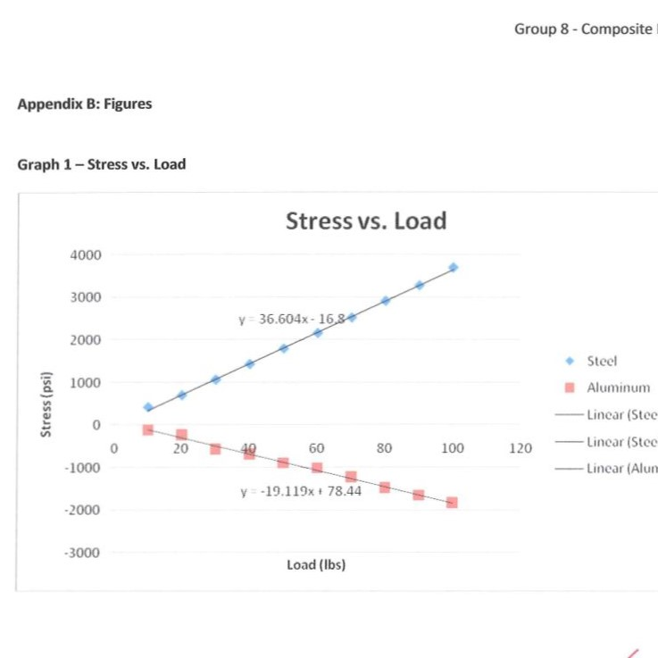
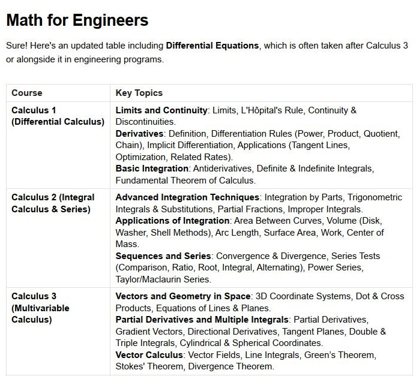
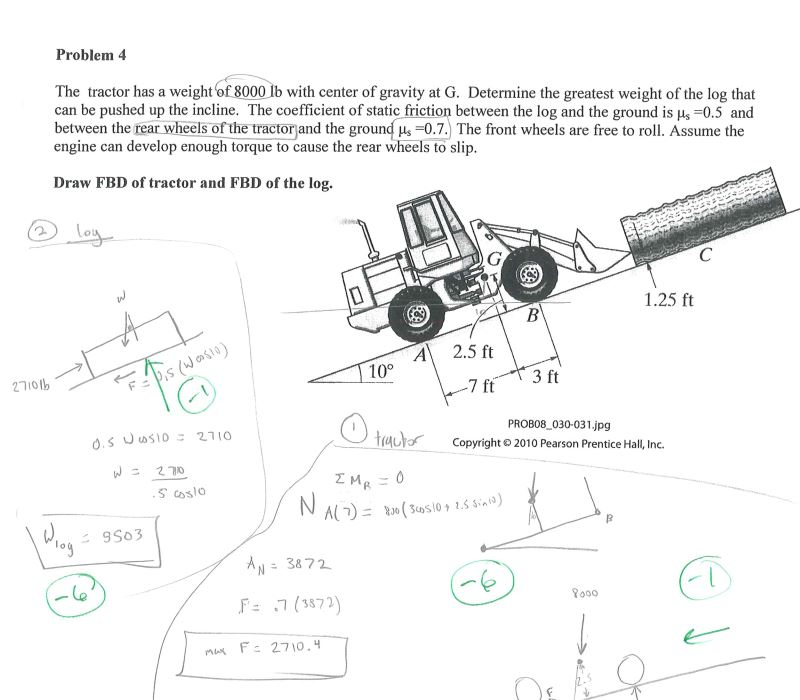
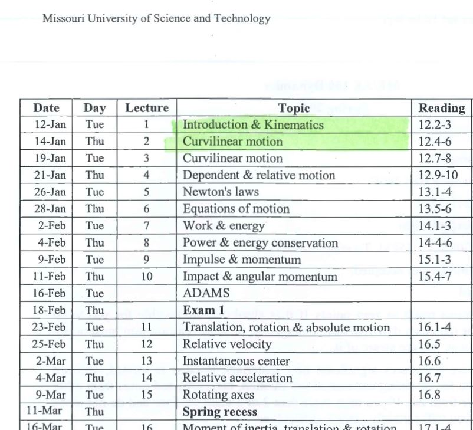
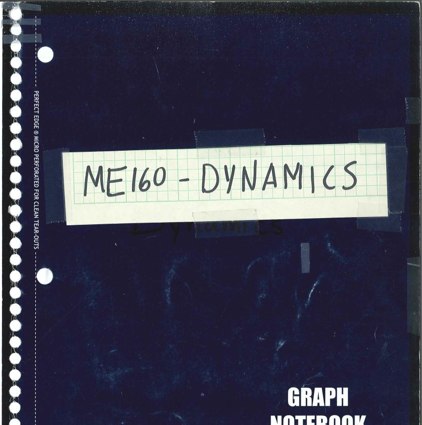
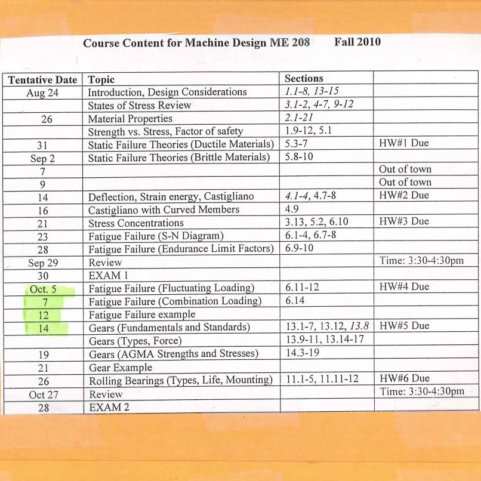
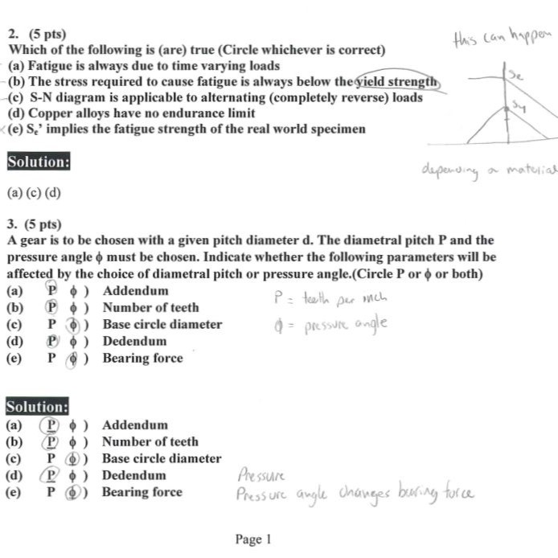
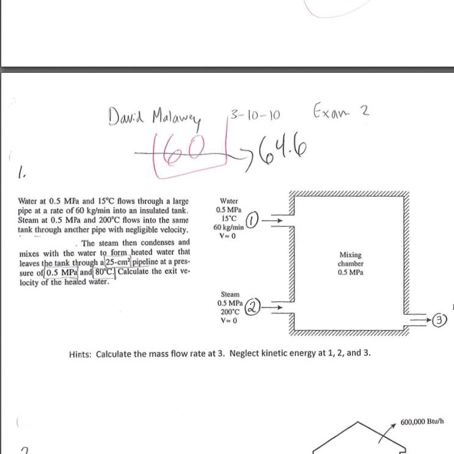

# Courses
Mechanical Engineering Courses, organized by course curriculums.

_note: engineering knowledge is not fundamentally divided into these topics such as statics and dynamics. But in education and science, we assign these categories of engineering topics that are fairly recognized around the world.  Each individual course may also correspond to a specialty that characterizes an entire lifelong career of an expert in the field._

## Outline

_snapshot of the degree plan for mechanical engineer_

Download the PDF course outline. (as of Feb 2025, just 1 page) This is a placeholder for a more thorough document that explains a bit about syllabi of each course, together with the degree plan.
* [Mechanical Degree Plan PDF](https://raw.githubusercontent.com/dmalawey/openME/main/docs/2008_ME_degreePlan.pdf)

## IDE110-Mechanics of Materials
Mechanics of Materials applies physics to physical materials.  Deformation, bending, loads, strain, yield strength, elastic modulus, are concepts put to work in Mechanics of Materials.  IDE stands for interdisciplinary engineering, and this course is assigned to IDE because several curriculums stand on mechanics, such as Structural Engineering, Mechanical Engineering, Aerospace Engineering, Civil Engineering, and so-on.  IDE110 was the course title (with 3 credit hours) and IDE120 was the lab title (an additional 1 or 2 credit hours, with one long meeting per week and a report following).

Download the labs for mechanics of materials here:
* [IDE110 Notebook](https://raw.githubusercontent.com/dmalawey/openME/main/docs/IDE110_Mechanics_Notes.pdf)
* [IDE120 Lab Reports](https://raw.githubusercontent.com/dmalawey/openME/main/docs/IDE120_labs.pdf)

## MATH210-Calculus
The binder covers Calculus I, II, and III.  In reality, my math courses were complete chaos.  Back in high school, I missed out on calculus and took some hands-on electives instead, like pottery. Ultimately I enrolled at 3 different college campuses to catch up.   I wish my advisor would have urged me to enroll in calculus at the time I informed her I wished to become an engineer.  So in the summer after freshman year of college, I took calc-1 at saint louis community college back home, while working my lawncare business for cash.  Then during sophomore year, I took accelerated calc 2 and calc3 at the community college, which were compressed into 10 weeks each instead of an ordinary 5-month semester.  I became progressively more confused in each course, with a miserably dull & heartless professor about age 99.  It was solid 3-hour lectures starting at 7pm, and I wore out pencils scribbling away to keep pace with the whiteboard in hopes to study after class.  Everything moved way too fast as I tried to catch up my math to the pace of the ME degree.  (calc II is a prerequisite for almost all core courses).  By graduation, I couldn't even tell you which topics belong in which calculus course.  It was all a total blurr.

Download Calculus I, II, III binder
* [MATH210 Binder](https://raw.githubusercontent.com/dmalawey/openME/main/docs/MATH210_calculus_binder.pdf)

## ME50-Statics
Statics applies physics of forces, mass, friction, and geometry to physical designs to evaluate static forces (non-moving).  It is the key principal for structures and also for dynamic items during their static states, like a parked car. This course was actually called IDE50, in interdisciplinary department because it serves all engineering majors. 

Download Statics Content
* [IDE50 Binder](https://raw.githubusercontent.com/dmalawey/openME/main/docs/IDE50_StaticsBinder.pdf)
* [IDE50 NOTES](https://raw.githubusercontent.com/dmalawey/openME/main/docs/IDE50_StaticsNotes.pdf)

## ME160-Dynamics
Dynamics is physics applied to moving bodies.  Compute linear and rotating masses, forces, accelerations, and stored energy for machines.

Download the binders for dynamics here:
* [ME160 BINDER](https://raw.githubusercontent.com/dmalawey/openME/main/docs/ME160_Dynamics_Binder.pdf)
* [ME160 NOTES](https://raw.githubusercontent.com/dmalawey/openME/main/docs/ME160_Dynamics_Notes.pdf)

Thumbnails for Dynamics content
- 
- 

## ME208-Machine_Design
Machine Design is an application of prerequisite topics like statics, free body motion, and heavy geometry, towards assemblies that put the physics to work.

Download the binders for machine design here:
* [ME160 BINDER](https://raw.githubusercontent.com/dmalawey/openME/main/docs/ME208_machine_design_binder.pdf)
* [ME160 NOTES](https://raw.githubusercontent.com/dmalawey/openME/main/docs/ME208_machine_design_notes.pdf)

Thumbnails for Machine Design content:
-
-

## ME219-Thermodynamics
Thermodynamics is about energy.  We use thermo to measure, compute, control the flow of energy in various states.  Energy, heat, light, sound, flow, compression, waves, are all fundamentally energy and they follow the laws of thermodynamics.

Get the binders for thermodynamics here:
* [ME219 Thermodynamics Binder](https://raw.githubusercontent.com/dmalawey/openME/main/docs/ME219_Thermo_Binder.pdf) 
* [ME219 Thermodynamics Notes](https://raw.githubusercontent.com/dmalawey/openME/main/docs/ME219_Thermo_Notes.pdf)

# ME240 Instrumentation
Beginning with the best part, the powerpoint slides by Mitch Cottrell.  He was a nonprofessor teaching staff with loads of knowledge & made top notch content to teach instrumentation.  I think this was my favorite course from undergrad.
* Get [instrumentation slides, 42mb, 13 lessons](https://lobfile.com/file/SQ8Dhsza.zip)
