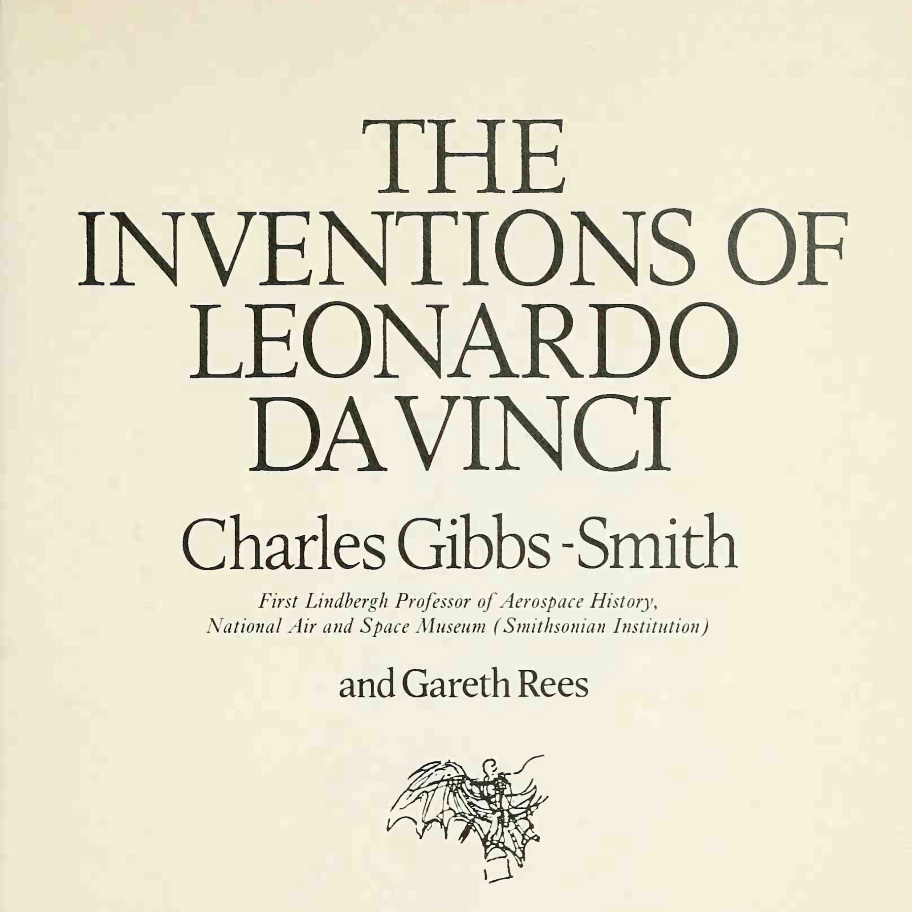
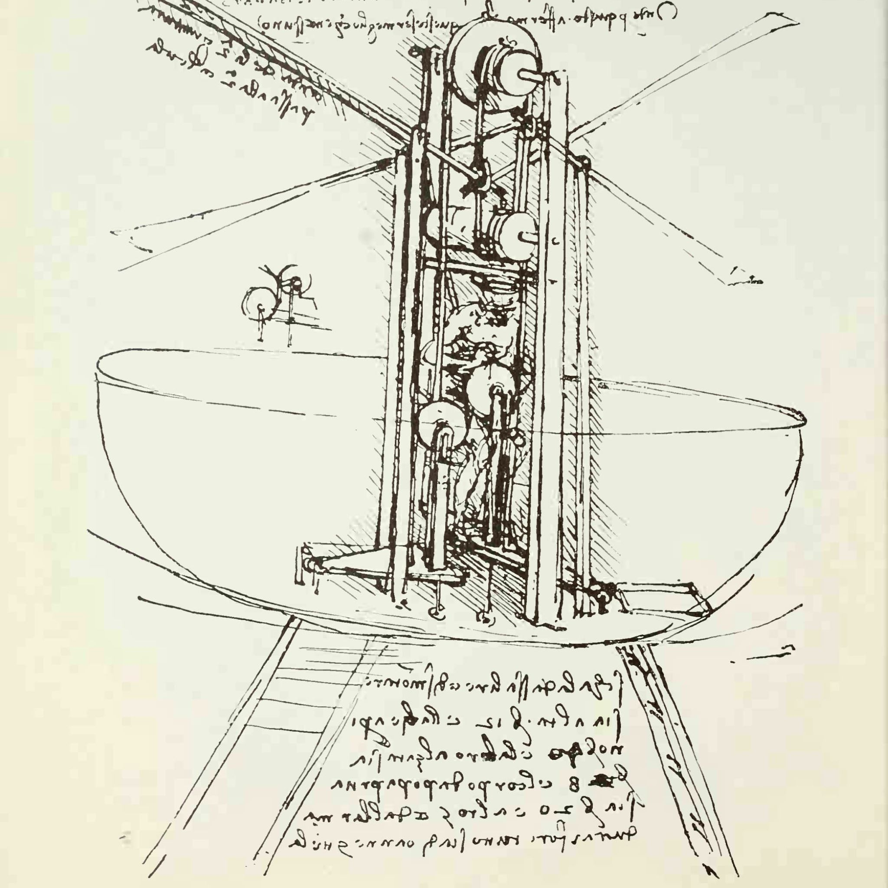
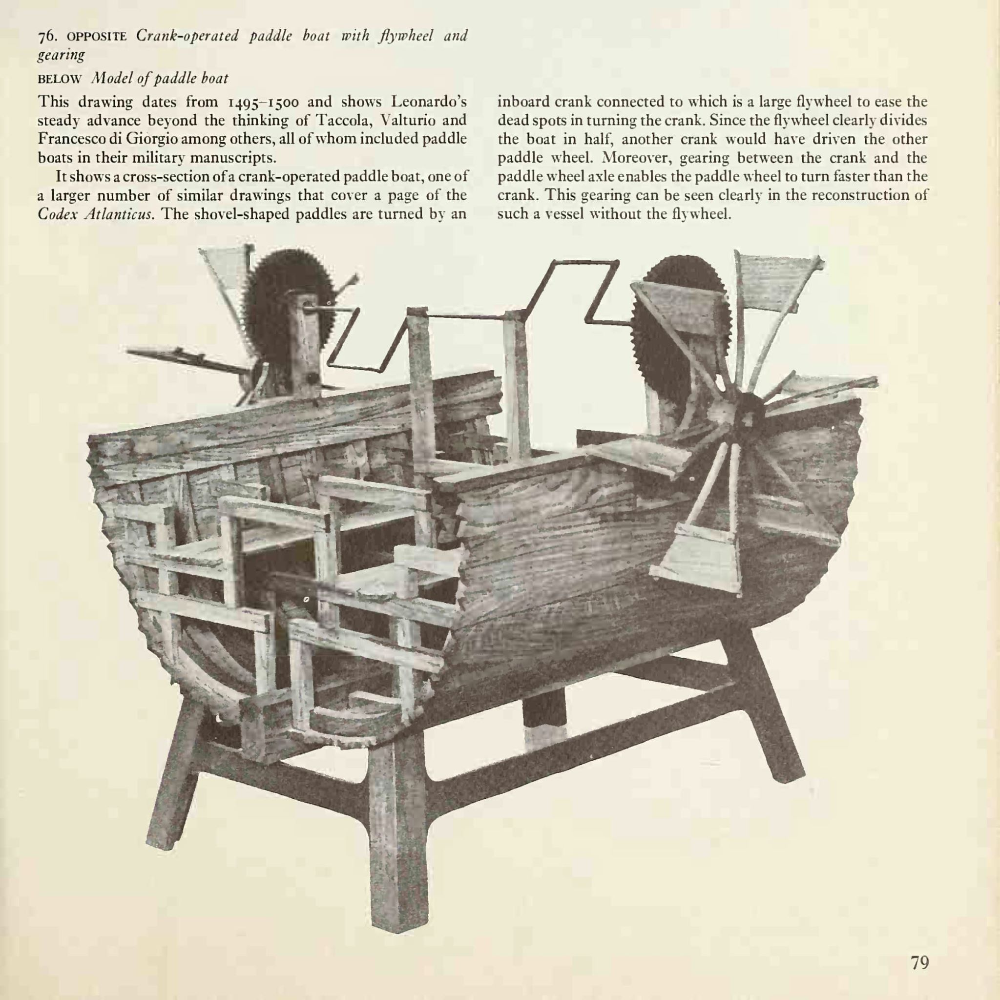
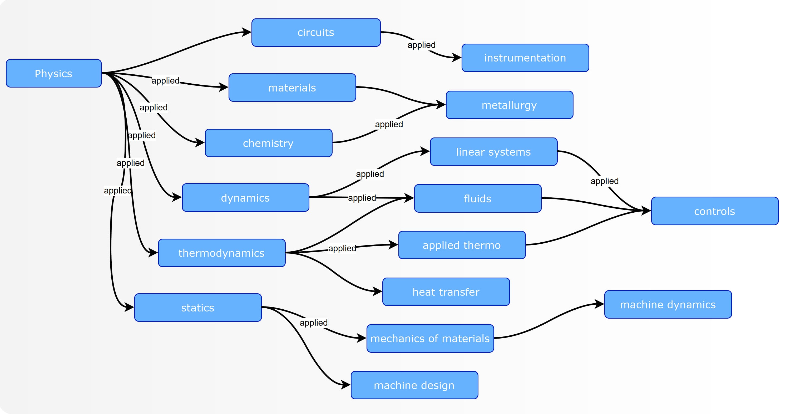
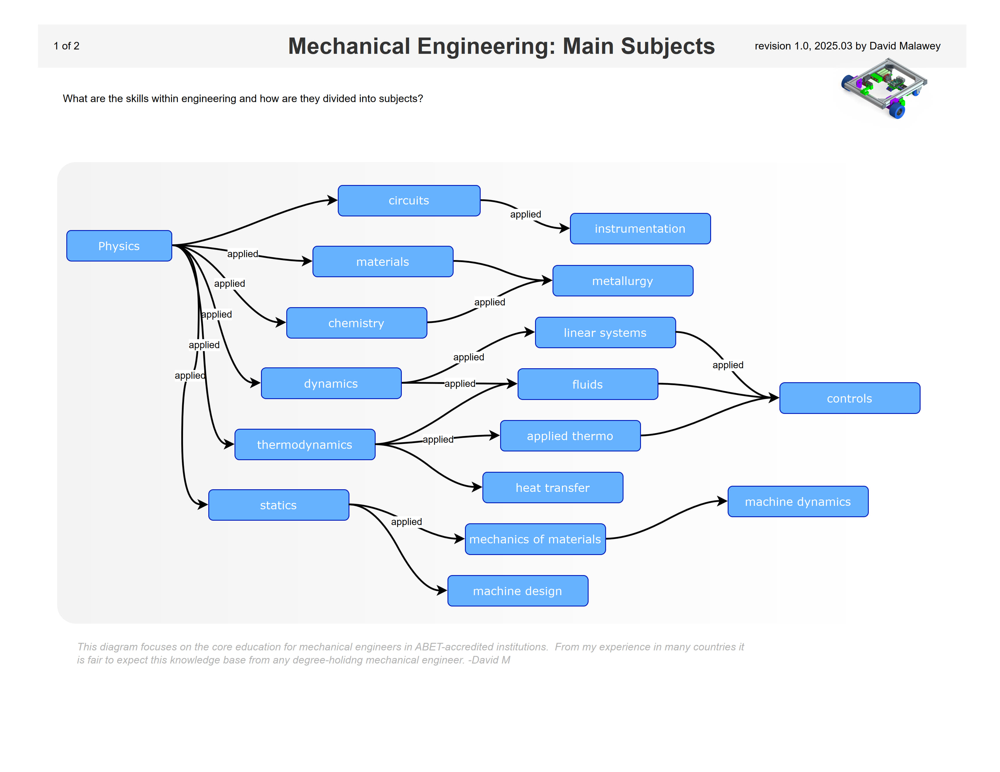
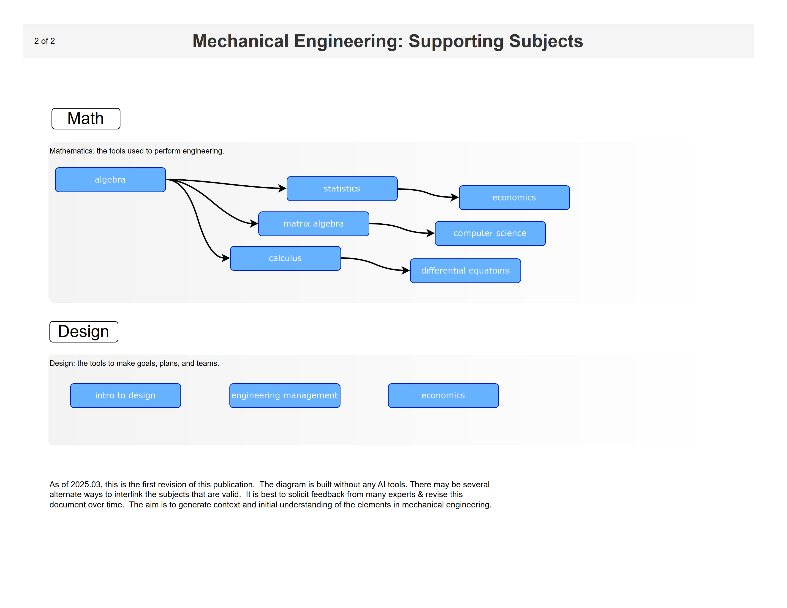
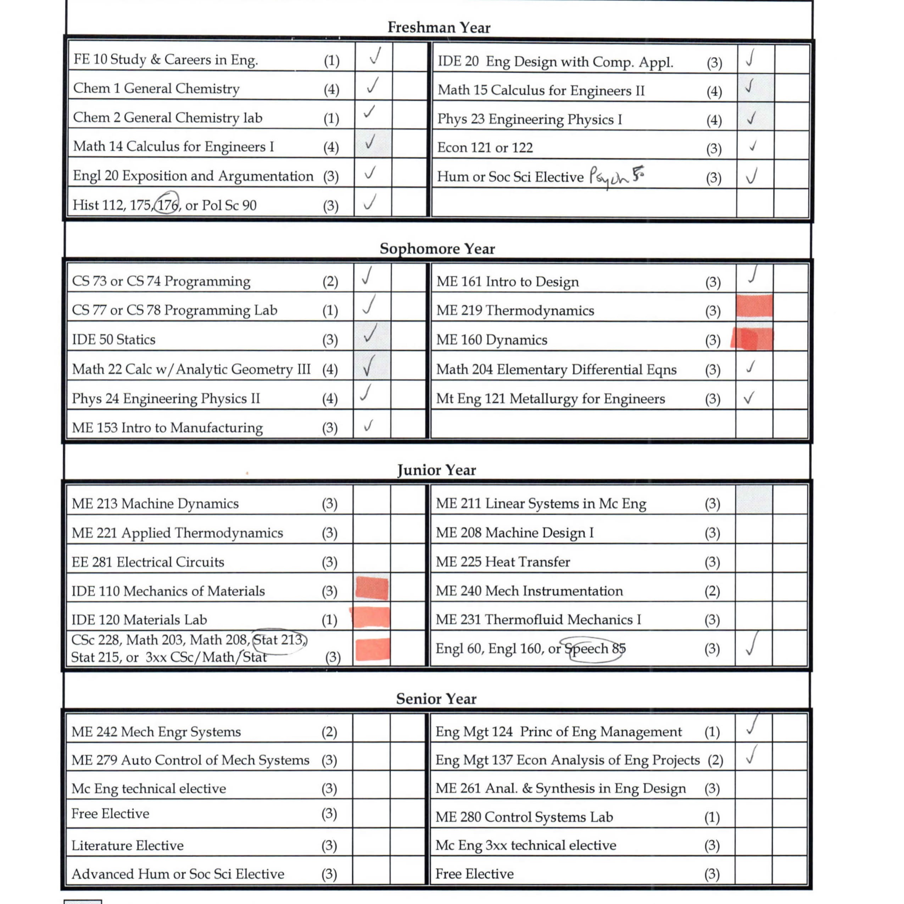

**Open Mechanical Engineering**
_mechanical engineering curriculum, free & open source_

##  About

Explore this repository to learn mechanical engineering.  During 2025 I'll upload a full, unmodified, uncut mechanical engineering degree with exams, homeworks, projects, and ABET accreditation.

Why? I have never yet found a full mechanical engineering degree online, complete & worked out by a human being, with all mistakes etc.  It just seems it ought to exist.  Hope this can be made useful.

The more I learn about engineers in society, it seems their strongest hesitations to make improvements relate to the fear of messing up.  But I messed up a lot.  So, perhaps this repository can stand as encouragement.  I earned summa cum laude but at the time it did not seem like I was good enough.  It came as a surprise with the final GPA and it almost felt like some professors had maybe bumped up my grades due to effort.  I might never know.  But effort is important.

# Motivation

Lenonardo Davinci was a mechanical engineer among other things.  This webpage has several reasons to exist, but one is to spread the power of a great mind.  You can indisbutably learn enough using only this webpage, to understand the full body of inventions of Leonardo Da Vinci and this understanding is a source of untold power.  Over time I discovered it to be more and more rare for an engineer, with or without a degree, to have this understanding.   Attached below is a nicely compressed copy of Davinci's works at only 30MB.

► [Davinci's inventions PDF](https://lobfile.com/file/U7LRr5QU.pdf)

- 
- 
- 

## Outline

Here is a snapshot of a mechanical engineering 4-year degree, with the list of courses taken.  These courses may vary by institution, but around the world the ME degree is fairly standard and this snapshot is a decent representation.

[Download the pdf outline](https://raw.githubusercontent.com/dmalawey/openME/main/docs/2014_toyotaProblemSolving.pdf)

- 
- 
- 
  
## More-Projects

Find more open source designs & educational content in the table below 🙂

| Project | Link | Purpose | 
| ------- | ---- | ------- | 
| OpenAir | qr.net/openairproject | take control of air, pressure, & flow with open elements | 
| OpenArm | qr.net/openarmproject | revolutionize robotic arms, a 10-year goal | 
| OpenBox | qr.net/openboxproject | array of open designs beginning with a steel box | 
| OpenGrow | qr.net/opengrowproject | open designs for hydroponics & aquaponics systems | 
| OpenJar | qr.net/openjarproject | array of designs for standard jars, threads, & seals | 
| OpenLab | qr.net/openlabproject | build a laboratory to design & fabricate anything. |
| openME  | qr.net/openmeproject  | full mechanical engineering degree, online for free | 
| OpenSpin | qr.net/openspinproject | array of designs based on parametric bearings | 
| SCUTTLE_Nigeria | qr.net/scuttleafrica | university-level robotics lab in Lagos, Nigeria |

