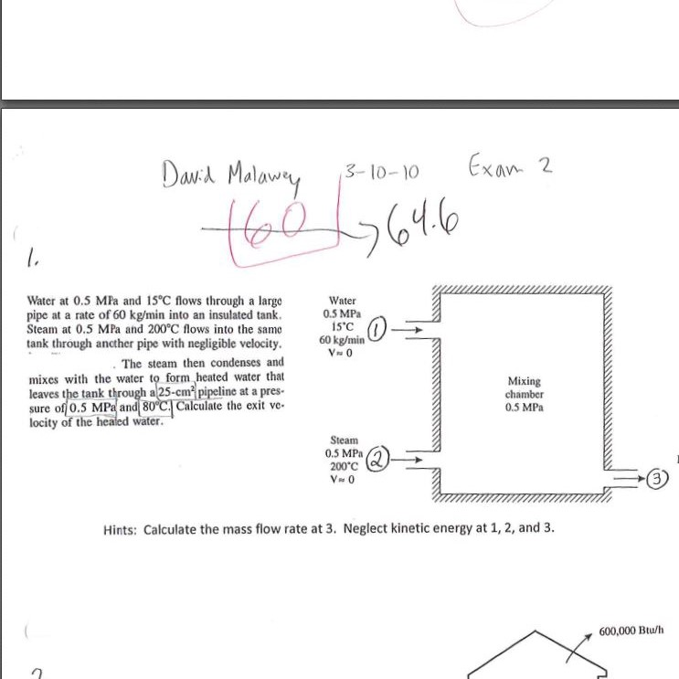
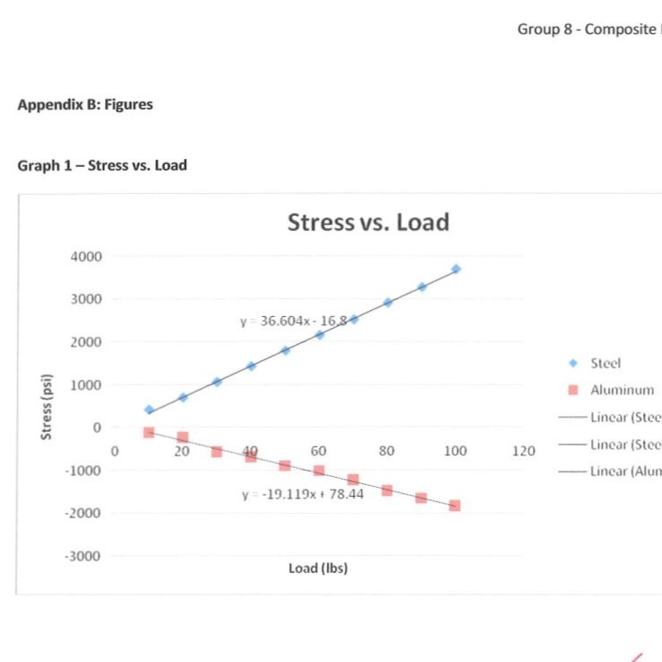

# open mechanical engineering
_mechanical engineering curriculum, free & open source_

##  About

Explore this repository to learn mechanical engineering.  During 2025 I'll upload a full, unmodified, uncut mechanical engineering degree with exams, homeworks, projects, and ABET accreditation.

Why? I have never yet found a full mechanical engineering degree online, complete & worked out by a human being, with all mistakes etc.  It just seems it ought to exist.  Hope this can be made useful.

The more I learn about engineers in society, it seems their strongest hesitations to make improvements relate to the fear of messing up.  But I messed up a lot.  So, perhaps this repository can stand as encouragement.  I earned summa cum laude but at the time it did not seem like I was good enough.  It came as a surprise with the final GPA and it almost felt like some professors had maybe bumped up my grades due to effort.  I might never know.  But effort is important.

## Thermodynamics
Thermodynamics is about energy.  We use thermo to measure, compute, control the flow of energy in various states.  Energy, heat, light, sound, flow, compression, waves, are all fundamentally energy and they follow the laws of thermodynamics.

Get the binders for thermodynamics here:
* [ME219 Thermodynamics Binder](docs/ME219_Thermo_Binder.pdf) 
* [ME219 Thermodynamics Notes](docs/ME219_Thermo_Notes.pdf)

## Mechanics of Materials
Mechanics of Materials applies physics to physical materials.  Deformation, bending, loads, strain, yield strength, elastic modulus, are concepts put to work in Mechanics of Materials.

Download the labs for mechanics of materials here:
* [IDE120 Lab Reports](docs/IDE120_labs.pdf)

## Course handouts
section for handouts.

## Course Exams
Section for exams, or this may go back into the binders when the PDFs are settled.

# ME240 Instrumentation
Beginning with the best part, the powerpoint slides by Mitch Cottrell.  He was a nonprofessor teaching staff with loads of knowledge & made top notch content to teach instrumentation.  I think this was my favorite course from undergrad.
* Get [instrumentation slides, 42mb, 13 lessons](https://lobfile.com/file/SQ8Dhsza.zip)
