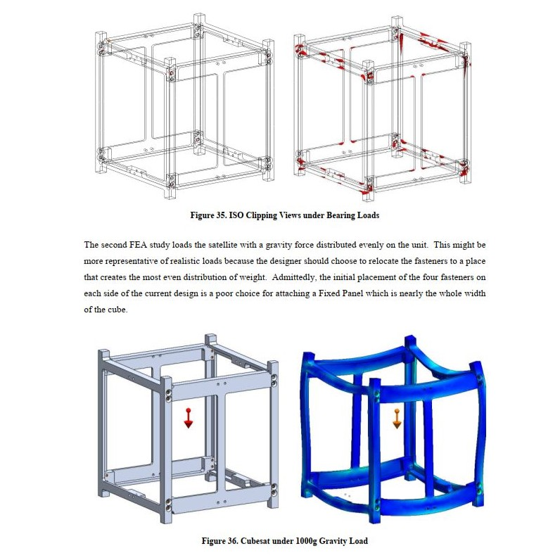
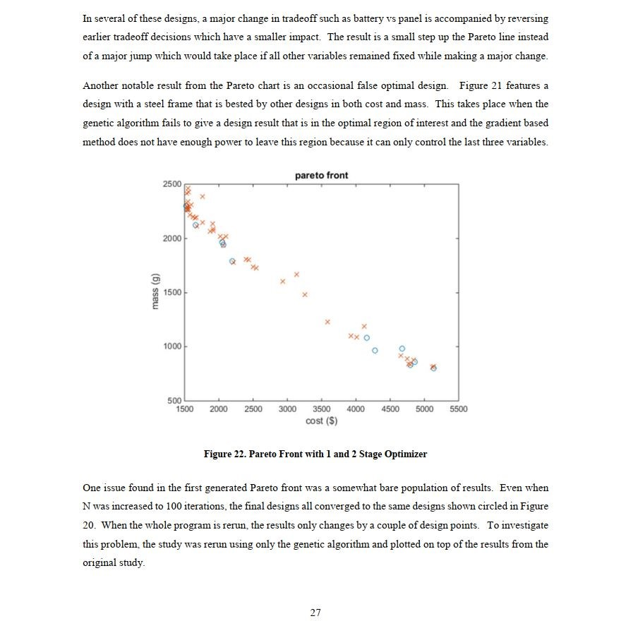
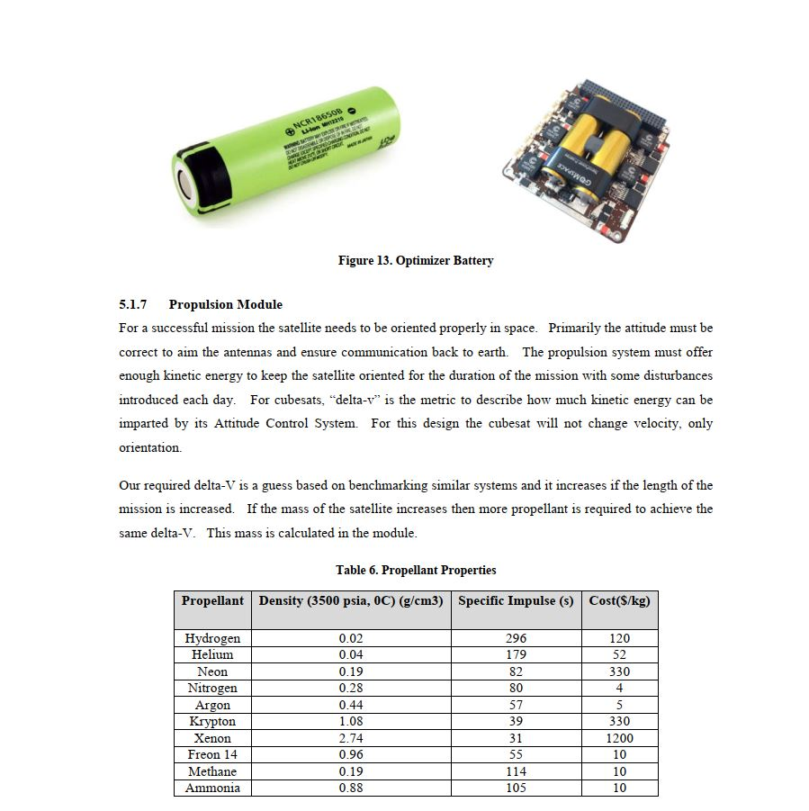

Graduate level contents for Mechanical Engineering

## ME689-Optimization

This course is for multidisciplinary system design and optimization, MSADO.  It's also called MDO for short.  Now that we reached a time in history when each system in a machine can be individually modeled for performance and key parameters, those models can be combined to be co-optimized.  A refined optimization for "fuel economy" of a vehicle for example will have tradeoffs and so the whole mission requires further ways to compare the possibilities and interprete them.  The Pareto Front is one thematic result of this course where a set of solutions presents the engineer with several options that each have optimality for one metric but have varying tradeoffs along another metric.  The pareto front can be represented on a 2-axis plot.   I'll adjust this description over time as I get more contents posted and for today I'll post the sets of slides from this course (June 29, 2025 DM)

For the course project we apply all of the necessary optimization tools to a real-world project.  I selected a cubesat, a small type of satellite which has design modules like solar panels, chassis configuration, battery storage, gas thrusters, to be optimized together for a given mission.  You can find a graphic powerpoint-type file under "Project Slides" and a report in the form of a journal article under "Project Report."  This course was delivered by Dr. Douglas Allaire who is a brilliant engineer.  He earned his PhD at MIT and came to Texas A&M about the same time I began my masters' degree.  One day on campus I saw him arriving by car in the blistering heat, and taking the 10 minute walk to his office from our poorly planned parking zones.  His vehicle was an old 90's ford ranger, near the same model I once had.  I think if someone chooses to teach instead of taking an enormous salary and a fancy company car, that person has integrity that most people don't have.  So I asked him to be on my masters' committee and he reviewed much of my work for my final thesis.

* get [ME689_Optimization_Slides set 1](https://raw.githubusercontent.com/dmalawey/openME/main/docs/ME689_Lectures_L1-9.pdf)
* get [ME689 Optimization Slides set 2](https://raw.githubusercontent.com/dmalawey/openME/main/docs/ME689_Lectures_L10-17.pdf)
* get [Project Report](https://raw.githubusercontent.com/dmalawey/openME/main/docs/ME689_ProjectReport.pdf)
* get [Project_Slides](https://raw.githubusercontent.com/dmalawey/openME/main/docs/ME689_ProjectSlides.pdf)
* get ME689_Optimization_Binder (coming soon)

## ESET219 Digital Electronics
This course is a fundamental topic from Electronic Systems Engineering Technology as of 2016 instructed by Dr. Joseph Morgan at that time.  This is an undergrad level course but since it was outside of mechanical engineering it populated a huge gap in my knowledge of electronics design, critical for implementing modern control systems, evaluating mechatronics systems, and designing digital interfaces for mechanical processes. I included this course as an elective in my Masters and it's perhaps the highest impact-per-effort course to couple with a Mechanical Engineering background.  I would say to convert a mechanical engineer into a mechatronics engineer, this course carries you halfway there.

* [download ESET219_DigitalElectronics_Notebook PDF-4.7MB](https://raw.githubusercontent.com/dmalawey/openME/main/docs/ESET219_DigitalElectronics_Notebook.pdf)
* [Mechanical Design & Optimization of a Standardized Cubesat, PDF](https://raw.githubusercontent.com/dmalawey/openME/main/docs/thesis_malawey_2016.05.pdf)

## Thesis
A thesis is a core requirement of a Master of Science in engineering, for all ABET-accredited programs to my knowledge.  About half of the efforts of a masters degree is in coursework while the other half is in research efforts, and the thesis is the culmination of the research. The thesis for an MS degree is analogous to the Dissertation of a doctoral degree, but usually smaller and less intensive.

For this thesis on micro-satellite design, I applied existing graduate level engineering and generated new knowledge based on the results of a project.  The new results focus on an implemenation of optimization algorithms for a multidisciplinary design.  Something novel about this work is the blending of heuristic and gradient based algorithms for optimization.  Heuristic algorithms can produce nondeterministic results, with a factor of randomness, while the gradient based algorithms are purely mathematical, fully repeatable given the input dataset, and can be subject to imperfections in the input data.  This project uses fundamental mathematics that are equivalent to today's popular algorithms behind the big Artificial Intelligence inventions that are moving technology into a new space.

* download thesis PDF
* [Mechanical Design & Optimization of a Standardized Cubesat, PDF](https://raw.githubusercontent.com/dmalawey/openME/main/docs/thesis_malawey_2016.05.pdf)

- 
- 
- 

### Presentation
The below video is my thesis presentation, with a few professors called the "advising committee" who are the audience and the evaluators for a successful thesis defense.  I recorded this meeting together with the screen on my laptop, and you can hear the dialogue at the end of the video with some questions from the committee.

<iframe width="700" src="https://www.youtube.com/embed/XbSdwpLa4j4?si=Zgwt0q-5nCF2nQpp" title="YouTube video player" frameborder="0" allow="accelerometer; autoplay; clipboard-write; encrypted-media; gyroscope; picture-in-picture; web-share" referrerpolicy="strict-origin-when-cross-origin" allowfullscreen></iframe>
