Graduate level contents for Mechanical Engineering

_Note by DM: this folder is second priority comapred with the Undergrad contents.  I would estimate only 1% of engineers who earn a BSME continue to get a MS degree or more, from my perspective in north america.  I do believe there are diminishing returns in regards to engineering knowledge but there is an exponential boost in another way: understanding how research takes place.  There are two types of Masters degrees for engineers: a Master of Science or a Master of Engineering.  I would consider the M.Eng. to be a continuation of the bachelors where someone takes additional courses to fill in knowledge gaps or attain a footing in an adjacent discipline.  This works nicely for fields like mechanical + aerospace, mechanical + biomedical, or electrical + mechanical.  But my goal was twofold:  first, I wanted the combination that gives me power over control systems.  If a combustion engine has mechanical and electronics systems, I wanted to be able to understand both sides and finally grasp the engine control theory.  And secondly, a goal I never knew until I arrived: becoming a researcher.  For the master of science degree, the student must publish at least two peer reviewed research papers under the guidance of a mentor who has his PhD and research experience.  When you make your first research paper you begin to see how humans collectively develop scientific knowledge and exchange it.  For me, this was magical because I saw how I could truly make a unique impact.  Research is how I realized that grad students can actually teach their professors new knowledge.  They can gain brand new knowledge that no human ever found, and they can compare their findings with other global experts.  The methods of journal categorization and peer reveiw and conferences are essentially foreign to an undergrad without exposure.  The undergrad operates in a one-way system of knowledge from teacher to student.  Now, my knowledge can flow in any direction.  Other experts to me, me to others, or from myself to a text within a body of texts that becomes synergetic and sprouts new knowledge nodes that get retrieved by the world.  If you love learning, this experience is one of a lifetime._

As for the data provided in this section: See the image below of the data midway through consolidation.  Some bulky files need compression still to fit in the 25mb criteria, some tiny files must be combined, and some non-readable files like software scripts and matlab files need to be made readable and recompiled.  This note updated 2026.05.05 DM.

- 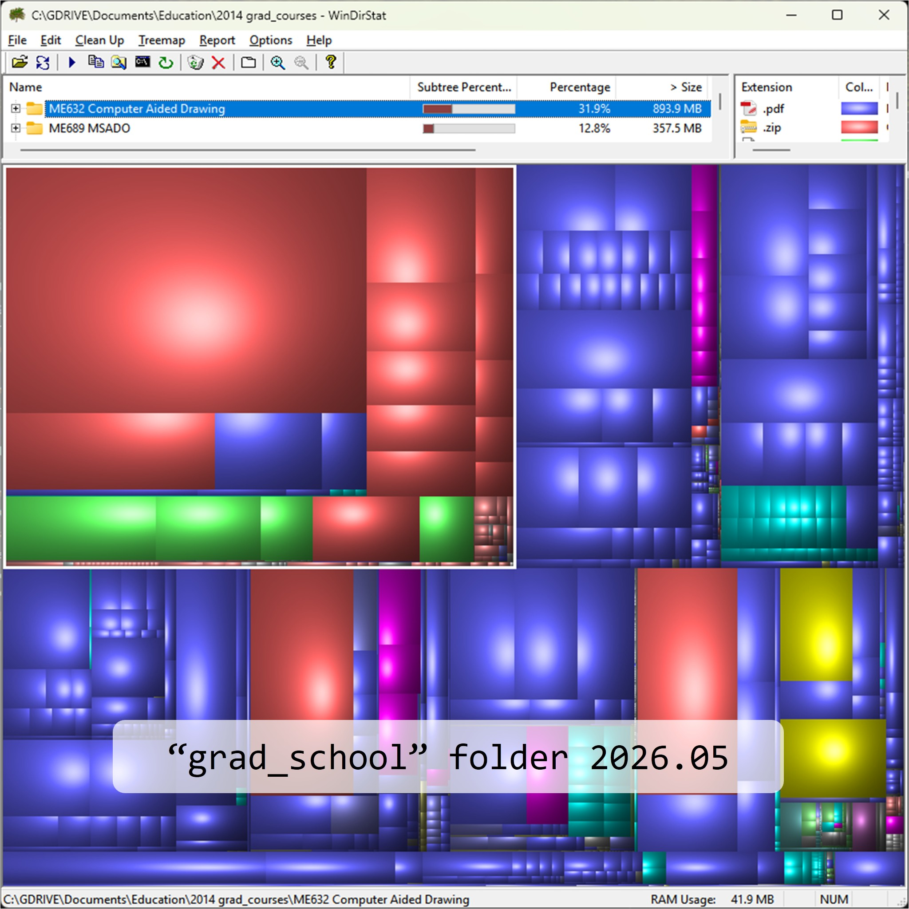
- 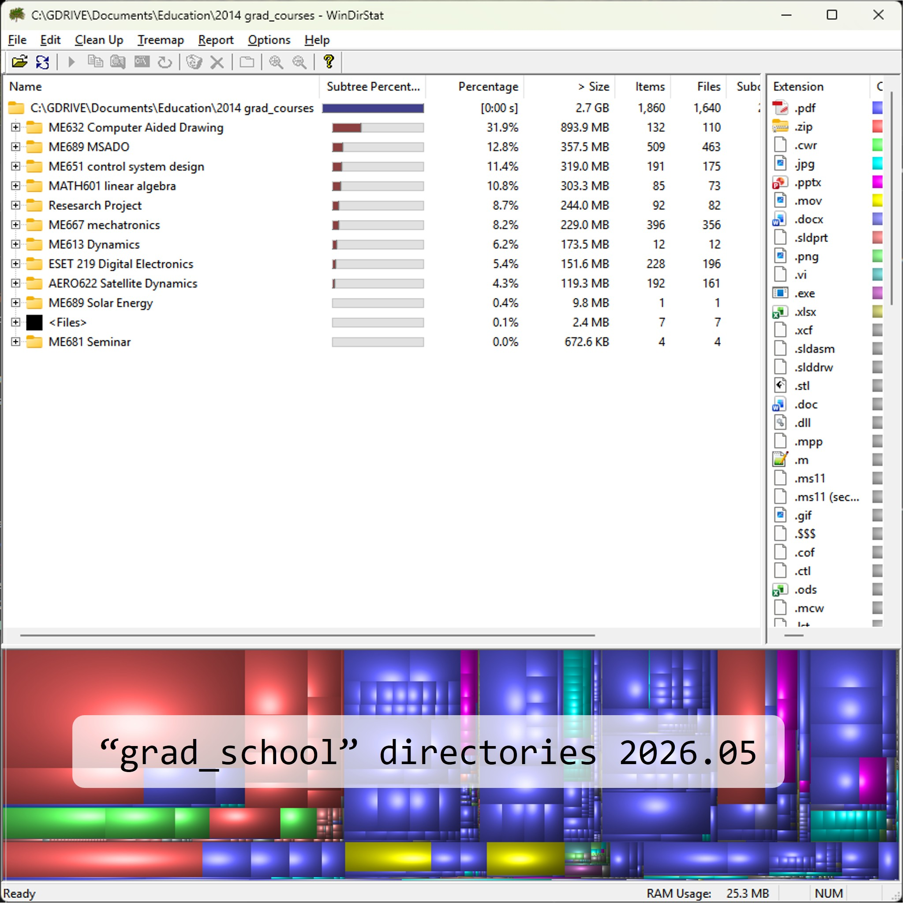
- 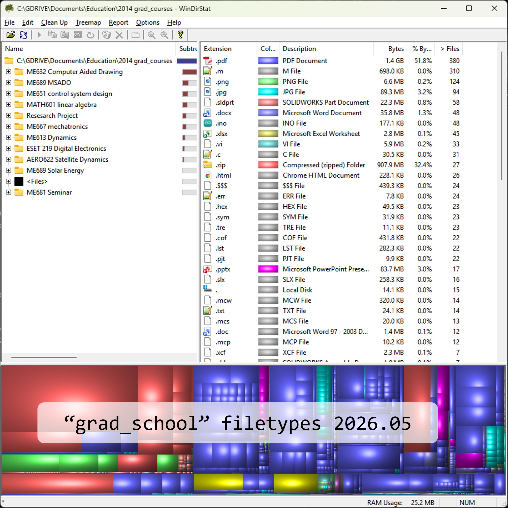

## ME613 Dynamics
This is the graduate-level course sister to the undergraduate-level dynamics course which all mechanical engineers take.  It covers seemingly simple topics such as planar kinematics (motion in 2D without forces and mass), including motion of rolling and jointed mechanisms.  It includes conversion of problems into computer codes for students to run simulation or complex computations on the computer using Matlab (the most famous software for engineers).  The course finishes with a complete "developing the equations of motion for rigid body systems" so at last we are computing multiple bodies, with interacting relationships, having mass, and in planar and 3D spaces. This course involves fancy tricks like creating new coordinate systems that are non-body-fixed, meaning the math is performed with the perspective of coordinates that are redefined (ie, the shocks on your bike computed from the ground can inform forces to build a ramp, rather than computing it from the fixed frame of the bicycle.)

Having this course makes it obvious that Boston dynamics is performing elementary engineering tasks, the same we would expect to see before humans ever reached the moon.  Notice the severe limitation of this material that all of the bodies are still theoretical, rigid parts with no flexure.  That means if you build a robot and you want to compute it's motion with basic mathematics, you'll spend huge sums of money to buy exotic stiff materials and lightweighting by heavy CNC carving.  You'd reduce mass sufficiently that each body has little inertia, so that each body can remain rigid enough to make all the dynamics computations without requiring knowledge of bending conditions, thermal stresses, or any characteristics that change throughout time. The human arm has ligaments that stretch during the pitch of a baseball while a rudimetary robot has no elongation of any members.  And the robot would not handle flexible materials, only those estimated as point masses.

* get [dynamics notebook](https://github.com/dmalawey/openME/blob/09677f8a571ef348861ae6314c6be9ce0ae10df0/docs/ME613_Notebook.pdf) with syllabus, exams, and homeworks
* get [dynamics lecture slides](https://github.com/dmalawey/openME/blob/09677f8a571ef348861ae6314c6be9ce0ae10df0/docs/ME613_LectureSlides.pdf) with the provided slides for the course
* get [dynamics matlab guide](https://github.com/dmalawey/openME/blob/09677f8a571ef348861ae6314c6be9ce0ae10df0/docs/ME613_MatlabGuide.pdf) which is a whole printed text for implementing dynamics in matlab
* get [dynamics lecture notes](https://github.com/dmalawey/openME/blob/09677f8a571ef348861ae6314c6be9ce0ae10df0/docs/ME613_LectureNotes.pdf), the slides complemented with my notes

If you pass this course you're equipped to build a boston dynamics robot but not the Toyota's Miro, which handles a flexible basketball that interacts with air and rotating inertias to dribble and land a freethrow.  In the photos from left: a snip of the textbook cover, the robot that can be built with the course knowledge, and a more advanced robot which requires more sophisticated dynamics.

- 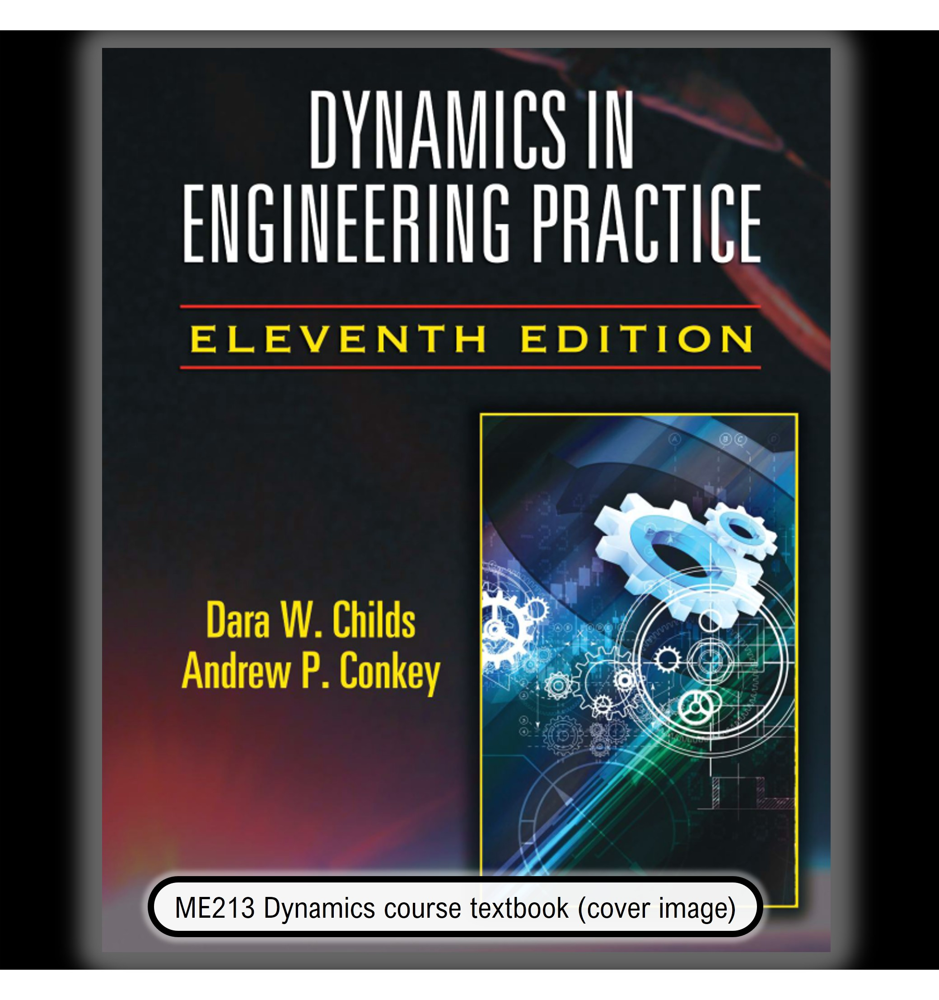
- 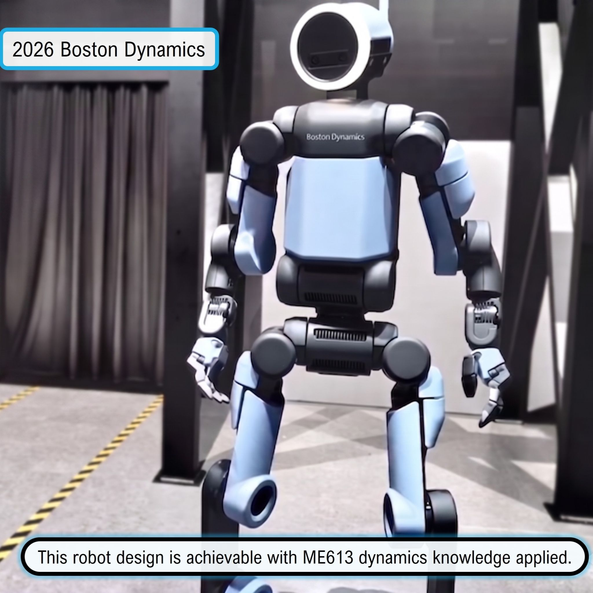
- 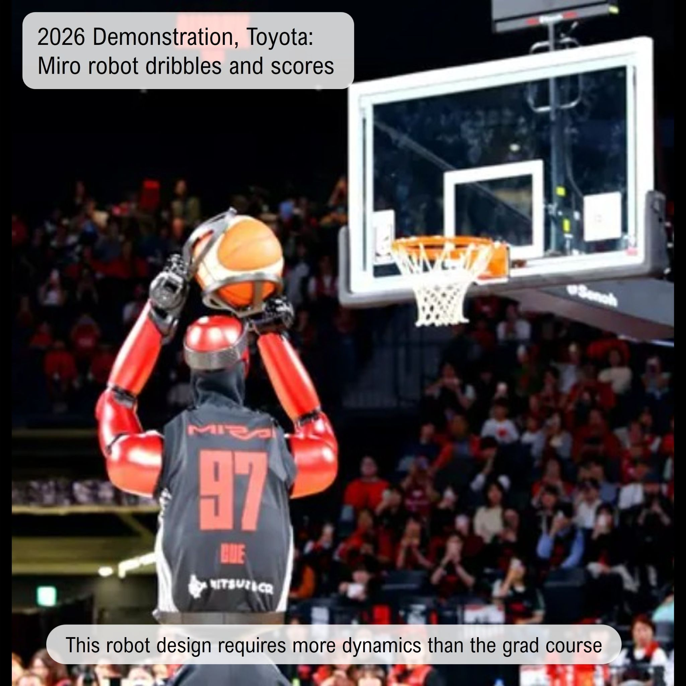

## ME632 CAD modeling
The cad modeling course is dual-listed, meaning the same material covers an undergraduate and graduate level course offering.  Sometimes dual-listed courses are challenging for undergrads, but this one was easy and truly required no graduate-level engineering.  I enrolled because I wanted experience with CAD modeling in Solidworks, and the instructor was a business owner who manufactured heavy metal assemblies, mainly for the oil-and-gas customers.  Because of this, the focal manufacturign method was sheet-metal as were the selected simulation lessons and fabrication tools we learned - sheet metal bending and drawing was included.  It also included learnign basic static load simulations.  Other CAD courses might cover fluid flow simulations, pressure chambers, or vibration analysis.  Note that simulation is a whole field of actions relating to CAD modeling - they are not central to CAD modeling per se, but Solidworks does offer toolboxes for these areas.  In the general public, each CAD software has different strengths.  Without simulation, they are faily equal in performance.  Once you couple simulation to the CAD effort then the softwares differ widely and users will find there is a "best choice" for each field of work.

ME632 included a final project made of a design of a hooklift trailer assembly - a machine on the back of a truck that offloads or onloads a utility dumpster.   So, my team of three performed a design of the main features, pivoting geometry, and piston configuration for the hooklift system, evaluated strength with FEA simulation, and reported on the performance of the design.  The students submitted real CAD files in their assignments so these CAD files are retained and available for me to post.  I hope to post those when I find the best way to hold larger (>25mb) files and folders.  (Github is not best for large file storage).

* Get [ME632 binder PDF](docs/ME632_ProjectReport.pdf) containing syllabus, some lecture notes, and homeworks.
* Get [ME632 Project Report PDF](docs/ME632_noebook.pdf) with three parts: project report, presentation slides, and practice presentation slides.
* Get **Design files** later once I can post them.

- 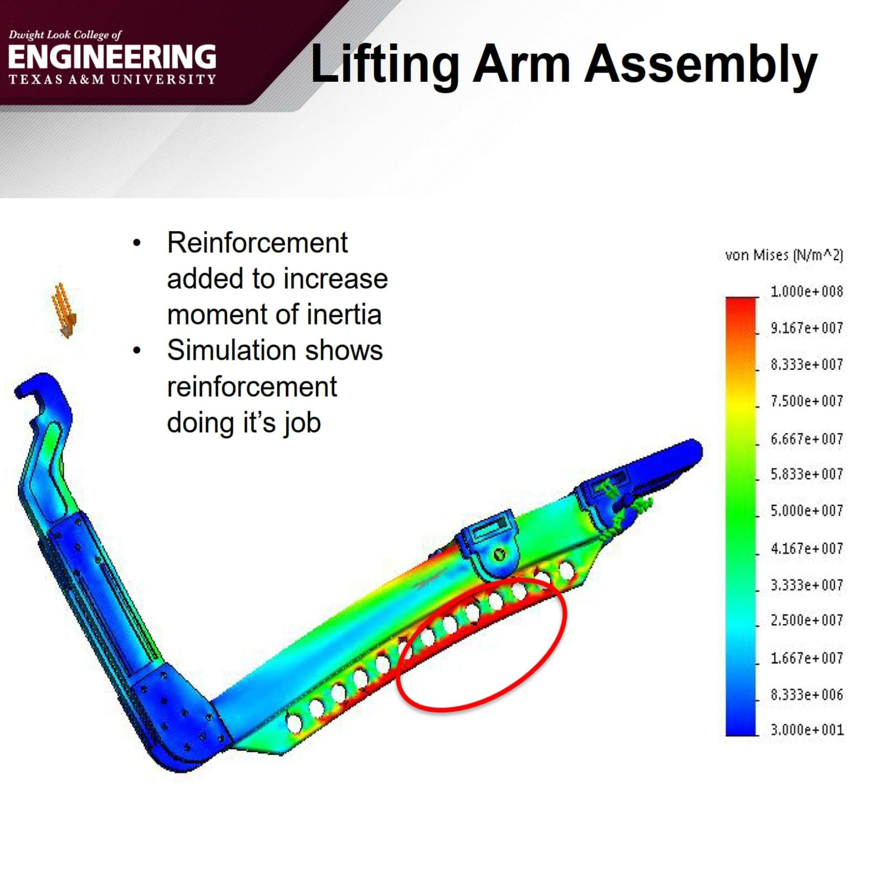
- 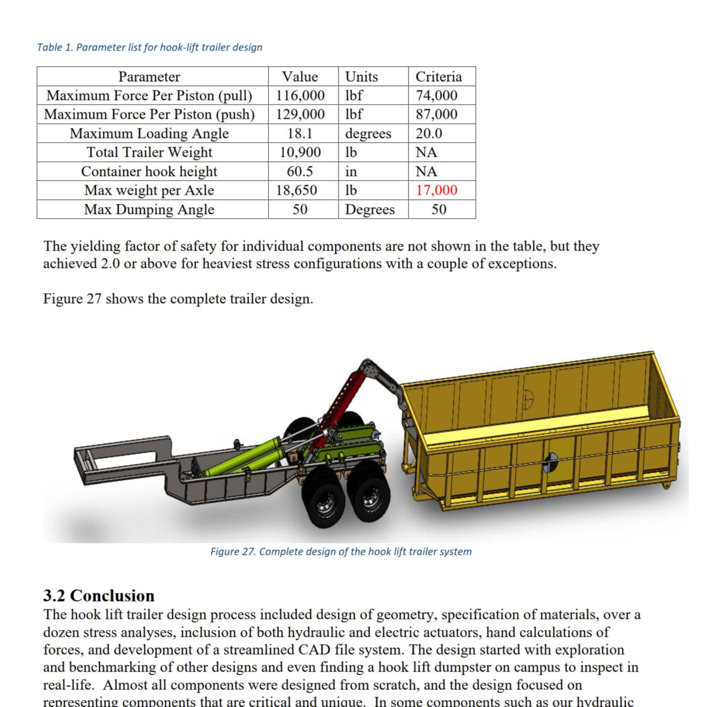
- 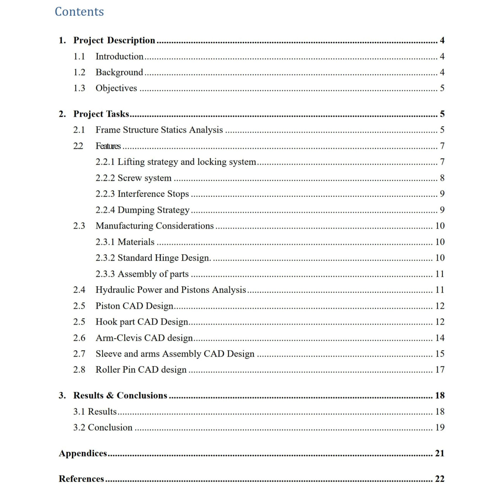

## ME667 Mechatronics
Mechatronics at graduate level was the most intensive course in my life.  I think it's a whole bachelor's degree of knowledge in one course, with a professor who earned his PhD at MIT (massachussets).  A great professor, Dr. Won-Jong Kim truly wished to transmit the full mechatronics core knowledge to us.  I could hardly list here what is included.  Digital logic, the architecture of a microcontroller, conversion of signals to digital signals, binary & hexadeciaml number systems, and tons more.  After about 6 weeks of lectures he announced "now you know how to build a computer from scratch" and he was not exaggerating - we even learned about the silicon NPN junctions that live inside the field effect transistors that make up all the embedded circuits in your life.

As of May 2026, the binder is still getting compressed as best as I can, around 36MB and 300 pages, with a whole folder of Lab files, each with directories of software files and more - they include programming in the C language, so by this time in my career I had learned the basics of the following languages and had mastered none of them: 
* Matlab
* C
* C++
* Python
* HTML
* CSS
and still more to come later, such as Markdown, Javascript, and bits of others as needed. So as a mechanical engineer I've begun understanding that software is a utility we use in engineering just like math, and that every engineer doing modern work is also a software engineer.  I should note this course was **the key to understanding digital control systems** for the first time.  I can say with certainty most of my peers, 95 of 100, finished a bachelor's degree without having any clue how to directly implement a control system on their own.  Thats because the modern controllers are digital, we were not equipped with understanding digital computations, yet we all took Controls courses in our senior year which was the culmination of almost all the mech-eng topics.  Devise a machine, put the machine into motion, measure the machine, balance a machine movement with the process required, and finally set the machine to control itself!  That's controls.  But I could not perform this until I went back to grad school, found this course, and passed it.

_Downloads that are ready for this course include the following_
* Get the [ME667 Labs PDF] containing lab summaries, reports, and softare scripts
* Get the [ME667 resources PDF](docs/ME667_resources.pdf) with the course handouts & scanned notes on those.
* Get the [ME667 homeworks PDF](docs/ME667_homeworks.pdf) with graded homeworks, nicely organized

- 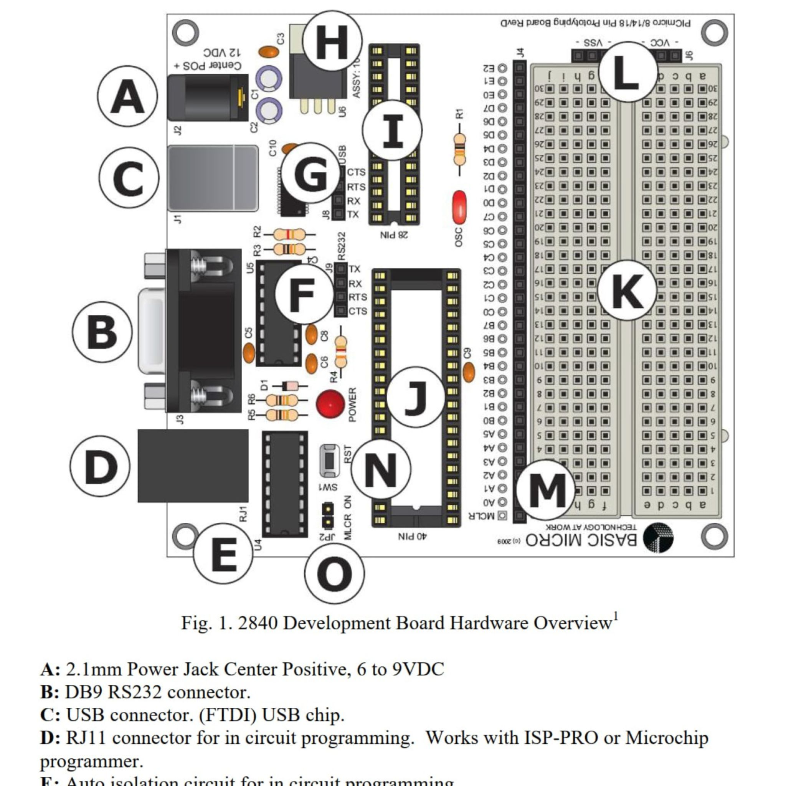
- 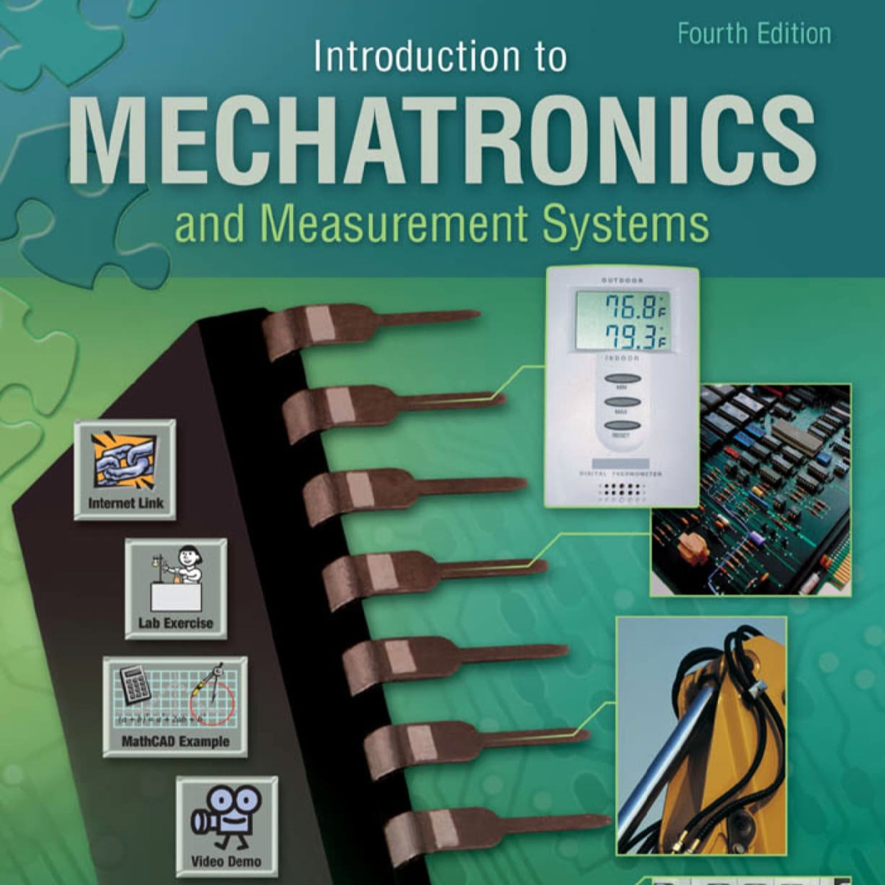
- 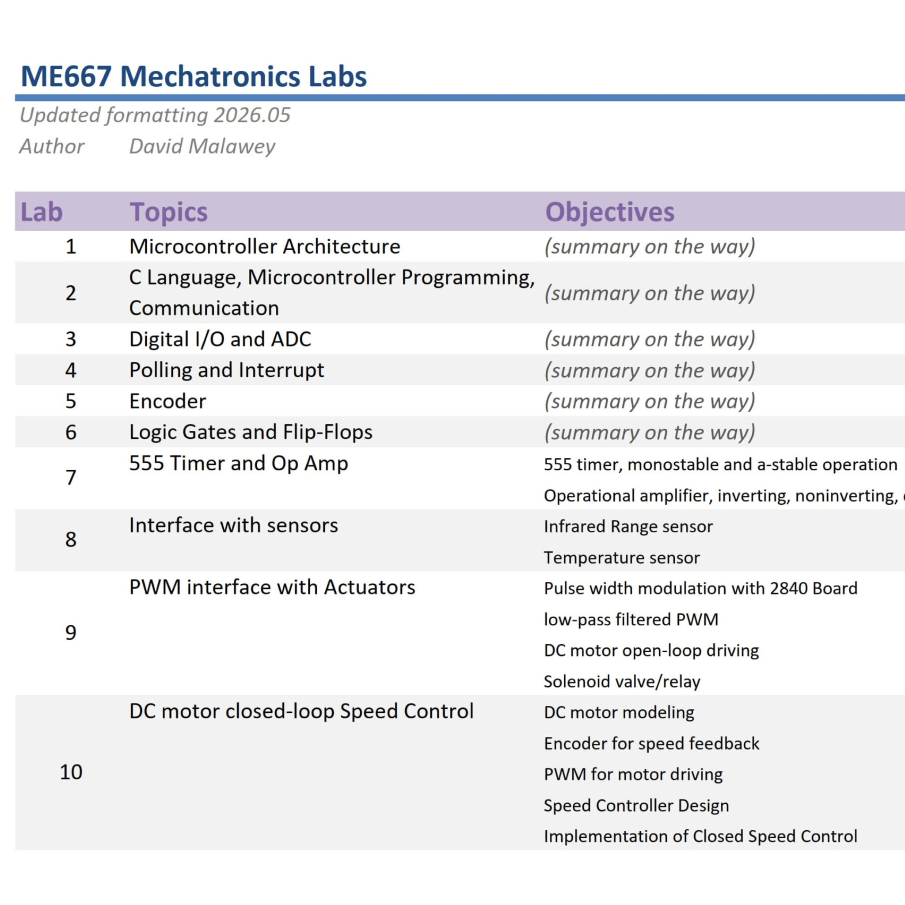

## ME689-Optimization

This course is for multidisciplinary system design and optimization, MSADO.  It's also called MDO for short.  Now that we reached a time in history when each system in a machine can be individually modeled for performance and key parameters, those models can be combined to be co-optimized.  A refined optimization for "fuel economy" of a vehicle for example will have tradeoffs and so the whole mission requires further ways to compare the possibilities and interprete them.  The Pareto Front is one thematic result of this course where a set of solutions presents the engineer with several options that each have optimality for one metric but have varying tradeoffs along another metric.  The pareto front can be represented on a 2-axis plot.   I'll adjust this description over time as I get more contents posted and for today I'll post the sets of slides from this course (June 29, 2025 DM)

For the course project we apply all of the necessary optimization tools to a real-world project.  I selected a cubesat, a small type of satellite which has design modules like solar panels, chassis configuration, battery storage, gas thrusters, to be optimized together for a given mission.  You can find a graphic powerpoint-type file under "Project Slides" and a report in the form of a journal article under "Project Report."  This course was delivered by Dr. Douglas Allaire who is a brilliant engineer.  He earned his PhD at MIT and came to Texas A&M about the same time I began my masters' degree.  One day on campus I saw him arriving by car in the blistering heat, and taking the 10 minute walk to his office from our poorly planned parking zones.  His vehicle was an old 90's ford ranger, near the same model I once had.  I think if someone chooses to teach instead of taking an enormous salary and a fancy company car, that person has integrity that most people don't have.  So I asked him to be on my masters' committee and he reviewed much of my work for my final thesis.

* get [ME689_Optimization_Slides set 1](https://raw.githubusercontent.com/dmalawey/openME/main/docs/ME689_Lectures_L1-9.pdf)
* get [ME689 Optimization Slides set 2](https://raw.githubusercontent.com/dmalawey/openME/main/docs/ME689_Lectures_L10-17.pdf)
* get [Project Report](https://raw.githubusercontent.com/dmalawey/openME/main/docs/ME689_ProjectReport.pdf)
* get [Project_Slides](https://raw.githubusercontent.com/dmalawey/openME/main/docs/ME689_ProjectSlides.pdf)
* get ME689_Optimization_Binder (coming soon)

## ESET219 Digital Electronics
This course is a fundamental topic from Electronic Systems Engineering Technology as of 2016 instructed by Dr. Joseph Morgan at that time.  This is an undergrad level course but since it was outside of mechanical engineering it populated a huge gap in my knowledge of electronics design, critical for implementing modern control systems, evaluating mechatronics systems, and designing digital interfaces for mechanical processes. I included this course as an elective in my Masters and it's perhaps the highest impact-per-effort course to couple with a Mechanical Engineering background.  I would say to convert a mechanical engineer into a mechatronics engineer, this course carries you halfway there.

* [download ESET219_DigitalElectronics_Binder PDF-4.7MB](https://raw.githubusercontent.com/dmalawey/openME/main/docs/ESET219_DigitalElectronics_Binder.pdf)

_Images from eset219: a project where I attempted control of the satellite rotation using two small DC fans, a graphical list of some main topics, and the hands-on lab for comparators using FPGA.  The FPGA lab is fantastic because we can see a digital implementation of directly-programmed digital logic, on a real circuit, where the configuration is made by DIP switches.  This is my first time handling an FPGA (though a very simplified one)._

- 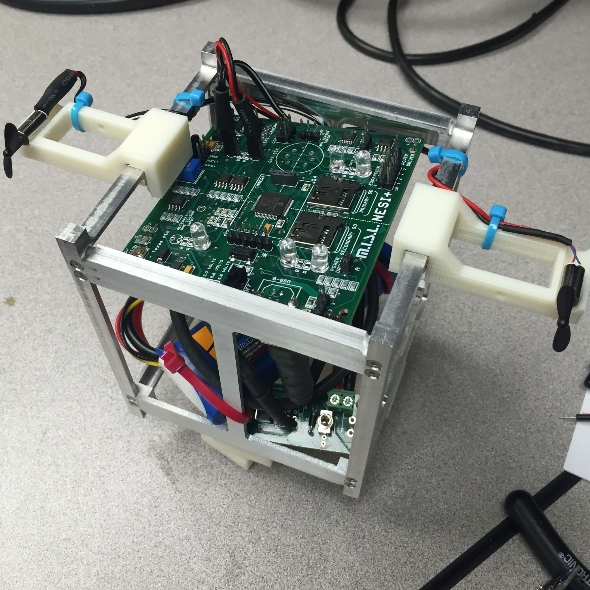
- 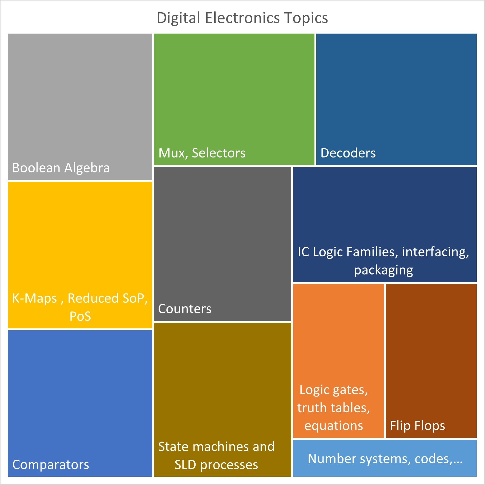
- 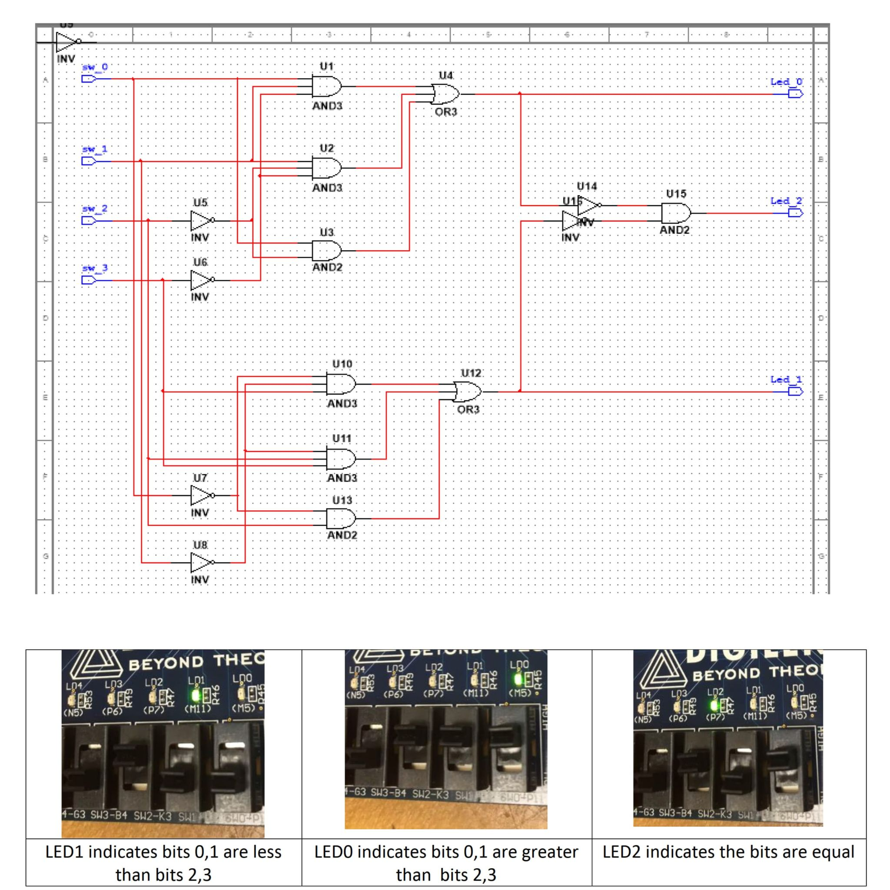

## Thesis
A thesis is a core requirement of a Master of Science in engineering, for all ABET-accredited programs to my knowledge.  About half of the efforts of a masters degree is in coursework while the other half is in research efforts, and the thesis is the culmination of the research. The thesis for an MS degree is analogous to the Dissertation of a doctoral degree, but usually smaller and less intensive.

For this thesis on micro-satellite design, I applied existing graduate level engineering and generated new knowledge based on the results of a project.  The new results focus on an implemenation of optimization algorithms for a multidisciplinary design.  Something novel about this work is the blending of heuristic and gradient based algorithms for optimization.  Heuristic algorithms can produce nondeterministic results, with a factor of randomness, while the gradient based algorithms are purely mathematical, fully repeatable given the input dataset, and can be subject to imperfections in the input data.  This project uses fundamental mathematics that are equivalent to today's popular algorithms behind the big Artificial Intelligence inventions that are moving technology into a new space.

* **download items**
* [Mechanical Design & Optimization of a Standardized Cubesat, PDF](https://raw.githubusercontent.com/dmalawey/openME/main/docs/thesis_malawey_2016.05.pdf)
* Matlab Code, [Optimization Software](https://github.com/dmalawey/mdo)
* Thesis Presentation [PDF slides 1.3MB](https://raw.githubusercontent.com/dmalawey/openME/main/docs/thesis_slides_2016.pdf)

- 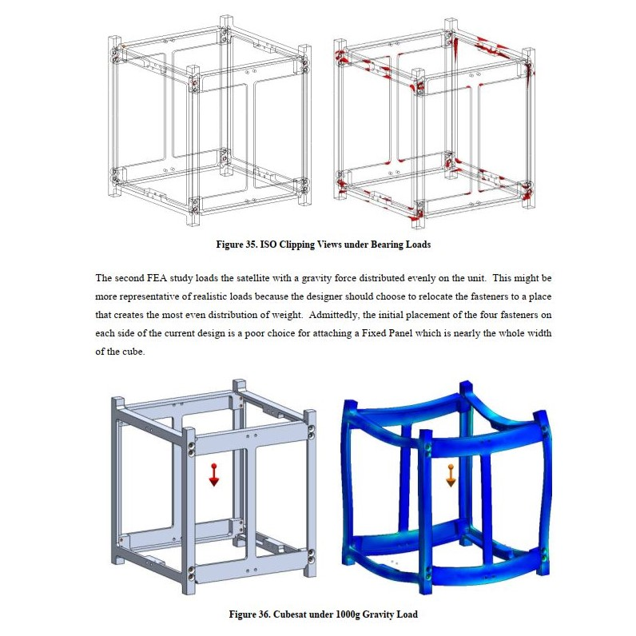
- 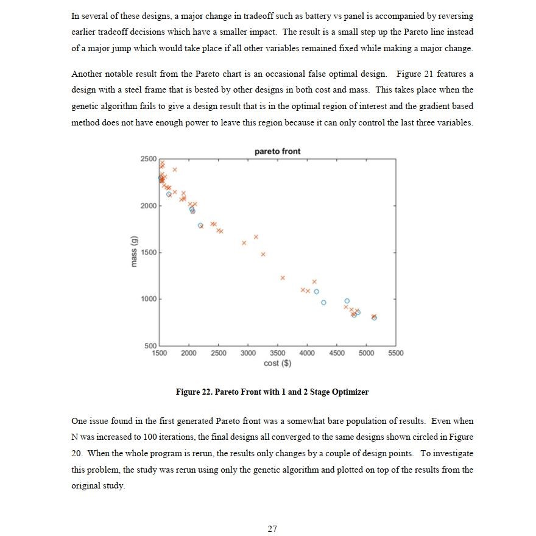
- 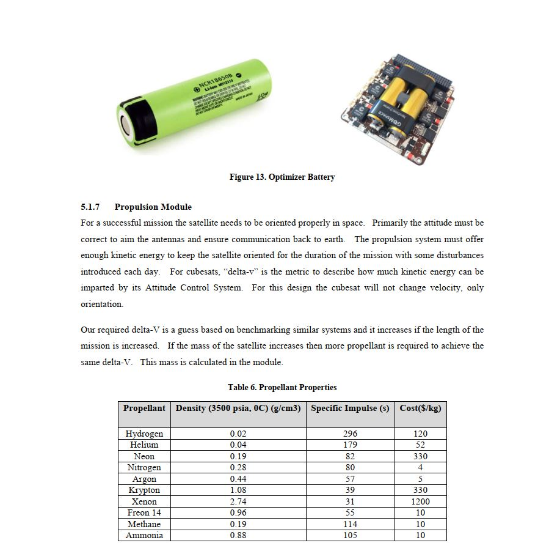

### Presentation
The below video is my thesis presentation, with a few professors called the "advising committee" who are the audience and the evaluators for a successful thesis defense.  I recorded this meeting together with the screen on my laptop, and you can hear the dialogue at the end of the video with some questions from the committee.

<iframe width="700" src="https://www.youtube.com/embed/XbSdwpLa4j4?si=Zgwt0q-5nCF2nQpp" title="YouTube video player" frameborder="0" allow="accelerometer; autoplay; clipboard-write; encrypted-media; gyroscope; picture-in-picture; web-share" referrerpolicy="strict-origin-when-cross-origin" allowfullscreen></iframe>
